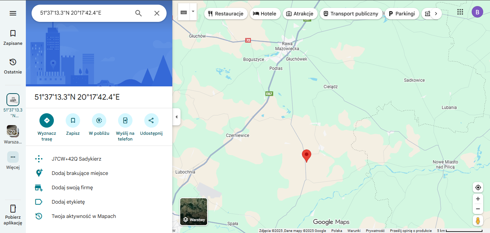
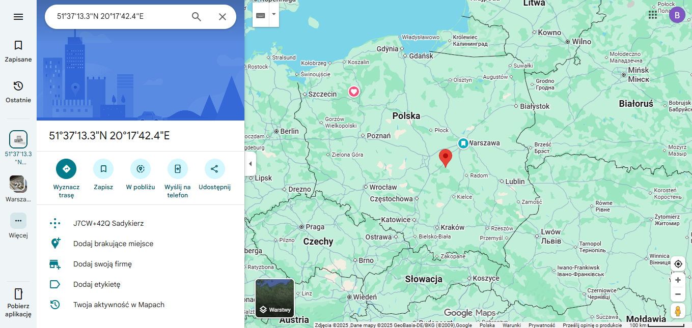

# Algorytmy i metody optymalizacji - Raport 1

## Temat: Optymalizacja bez ograniczeń - Projekt nr 1; Zestaw nr 13

### Bartosz Zaborowski 319996

#### 1. Dane

Przyjmujemy:

- promień Ziemi (poziom morza): 6378137 m,
- prędkość sygnału z satelitów: 299792458 m/s.

Dane przedstawiają informacje o położeniu (liczba satelit wynosi N = 13) satelitów systemu pozycjonowania (w systemie współrzędnych sferycznych) oraz czasy nadejścia sygnału od nich.

Z treści zadania mamy podane dwie tabele z danymi:
**Położenie satelitów**

| Nr | Szerokość (dzies.) | Długość (dzies.)   | Szerokość kątowa | Długość kątowa    | Wysokość [m n.p.m.] |
| -- | ------------------ | ------------------ | ---------------- | ----------------- | ------------------- |
| 1  | 6.1559355081676    | 52.5457318089284   | 6° 9' 21.37" N   | 52° 32' 44.63" E  | 19 513 264.0        |
| 2  | 47.1886635984881   | 147.8037666254030  | 47° 11' 19.19" N | 147° 48' 13.56" E | 14 002 215.3        |
| 3  | -12.8232765555657  | -9.4526305456900   | 12° 49' 23.80" S | 9° 27' 9.47" W    | 13 862 417.9        |
| 4  | 54.7951930601781   | -127.2512659390310 | 54° 47' 42.70" N | 127° 15' 4.56" W  | 14 061 989.2        |
| 5  | 34.2437389209835   | 25.3517357204992   | 34° 14' 37.46" N | 25° 21' 6.25" E   | 13 761 866.5        |
| 6  | 53.6353221185862   | 64.8608900078692   | 53° 38' 7.16" N  | 64° 51' 39.20" E  | 13 893 736.4        |
| 7  | 43.0785026706136   | -8.0886091756957   | 43° 4' 42.61" N  | 8° 5' 18.99" W    | 13 460 953.4        |
| 8  | 20.1512104981551   | 62.5555486255998   | 20° 9' 4.36" N   | 62° 33' 19.98" E  | 13 819 354.8        |
| 9  | 49.2901079265804   | 44.1040081414650   | 49° 17' 24.39" N | 44° 6' 14.43" E   | 14 015 671.6        |
| 10 | 49.4552880799264   | -67.4173769536602  | 49° 27' 19.04" N | 67° 25' 2.56" W   | 13 800 039.6        |
| 11 | 38.2248532902654   | -46.1640423241860  | 38° 13' 29.47" N | 46° 9' 50.55" W   | 13 357 759.5        |
| 12 | 25.2062832986468   | 83.7474569414005   | 25° 12' 22.62" N | 83° 44' 50.84" E  | 13 759 876.0        |
| 13 | 43.4788434173197   | -7.4150994801044   | 43° 28' 43.84" N | 7° 24' 54.36" W   | 12 778 112.9        |

**Czasy dotarcia sygnału w sekundach**

| Nr satelity | Czas [s]           |
| ----------- | ------------------ |
| 1           | 0.09642964511743930|
| 2           | 0.08511665086736160|
| 3           | 0.08389667794635720|
| 4           | 0.08487585963182320|
| 5           | 0.06871295254797900|
| 6           | 0.07072441166066990|
| 7           | 0.06821871552527680|
| 8           | 0.07546001104207520|
| 9           | 0.06920176917880840|
| 10          | 0.07764842100743740|
| 11          | 0.07453795513145620|
| 12          | 0.07812844723686560|
| 13          | 0.06584869085813090|

#### 2. Rozwiązanie

Przy opracowywaniu rozwiązania, zdefiniowane zostały pomocnicze zmienne oraz parametry.

**Zbiory:**

- $S = \{1, 2, 3, 4, 5, 6, 7, 8, 9, 10, 11, 12, 13\}$ - zbiór satelit.

**Parametry:**
Wspomnianej wcześniej w treści zadania parametry jakie przyjmuję to:

- $R = 6378137[m]$ - poziom morza względem środka kuli ziemskiej (promień ziemii),
- $v_{syg} = 299792458 [m/s]$ - prędkość sygnału pochodzącego z satelitów,
- $h_i$ - Wysokość satelity względem powierzchni ziemii
- $\forall_{i \in S}\ r_i = h_i + R = 26378137[m]$ - wysokość satelity względem środka kuli ziemskiej,
- $\theta_i$ - Szerokość geograficzna satelity $i$ w stopniach
- $\phi_i$ - Długość geograficzna satelity $i$ w stopniach
- $b$ – nieznany bias czasowy zegara odbiornika, w sekundach, który przesuwa wszystkie zmierzone czasy sygnałów $t_i$.  

Poniżej tabela z wartościami odpowiadającymi każdemu z satelit:

|  i |   $\theta_i$      |    $\phi_i$        |   $h_i$ [m]  | $r_i = R + h_i$ [m] |
| -: | :---------------: | :----------------: | :----------: | :-----------------: |
| 1  | 6.1559355081676   | 52.5457318089284   | 19 513 264.0 | 25891401.0          |
| 2  | 47.1886635984881  | 147.8037666254030  | 14 002 215.3 | 20380352.3          |
| 3  | -12.8232765555657 | -9.4526305456900   | 13 862 417.9 | 20240554.9          |
| 4  | 54.7951930601781  | -127.2512659390310 | 14 061 989.2 | 20440126.2          |
| 5  | 34.2437389209835  | 25.3517357204992   | 13 761 866.5 | 20140003.5          |
| 6  | 53.6353221185862  | 64.8608900078692   | 13 893 736.4 | 20271873.4          |
| 7  | 43.0785026706136  | -8.0886091756957   | 13 460 953.4 | 19839090.4          |
| 8  | 20.1512104981551  | 62.5555486255998   | 13 819 354.8 | 20197491.8          |
| 9  | 49.2901079265804  | 44.1040081414650   | 14 015 671.6 | 20393808.6          |
| 10 | 49.4552880799264  | -67.4173769536602  | 13 800 039.6 | 20178176.6          |
| 11 | 38.2248532902654  | -46.1640423241860  | 13 357 759.5 | 19735896.5          |
| 12 | 25.2062832986468  | 83.7474569414005   | 13 759 876.0 | 20138013.0          |
| 13 | 43.4788434173197  | -7.4150994801044   | 12 778 112.9 | 19156249.9          |

- $t_i$ - Czasy nadejścia sygnału $i$ w sekundach:

|  i  |      $t_i$ [s]      |
| :-: | :-----------------: |
| 1   | 0.09642964511743930 |
| 2   | 0.08511665086736160 |
| 3   | 0.08389667794635720 |
| 4   | 0.08487585963182320 |
| 5   | 0.06871295254797900 |
| 6   | 0.07072441166066990 |
| 7   | 0.06821871552527680 |
| 8   | 0.07546001104207520 |
| 9   | 0.06920176917880840 |
| 10  | 0.07764842100743740 |
| 11  | 0.07453795513145620 |
| 12  | 0.07812844723686560 |
| 13  | 0.06584869085813090 |

Aby przejść do układu kartezjańskiego $(x, y, z)$  mając podane współrzędne sferyczne $(r, \theta, \phi)$, należy zastosować wzory rozpisane przeze mnie poniżej:

- $$x = x(r,\theta, \phi) = r\ \cos\theta\ \cos\phi$$
- $$y = y(r,\theta, \phi) = r\ \cos\theta\ \sin\phi$$
- $$z = z(r,\theta, \phi) = r\ \sin\theta$$

Kiedy wykonamy podstawienie danych do powyższych wzorów, uzyskamy współrzędne satelitów w układzie kartezjańskim wyrażone w metrach. Poniżej tabela z przeliczonymiwartościami:

| $i$| $x_i$        | $y_i$        | $z_i$       |
| -- | ------------ | ------------ | ----------- |
| 1  | 15654494.42  | 20435085.79  | 2776457.96  |
| 2  | -11720439.55 | 7379678.68   | 14950933.06 |
| 3  | 19467763.22  | -3241242.83  | -4492282.59 |
| 4  | -7132840.60  | -9379731.43  | 16701556.28 |
| 5  | 15045421.80  | 7128566.36   | 11333073.96 |
| 6  | 5106157.74   | 10881138.20  | 16324118.22 |
| 7  | 14346680.47  | -2038925.08  | 13550094.17 |
| 8  | 8738968.74   | 16827214.33  | 6958013.95  |
| 9  | 9551465.72   | 9257309.96   | 15458950.29 |
| 10 | 5036993.30   | -12110950.83 | 15333374.69 |
| 11 | 10738212.51  | -11183646.42 | 12211570.56 |
| 12 | 1984410.46   | 18112094.11  | 8576347.10  |
| 13 | 13784075.04  | -1793932.77  | 13181160.45 |

Aby odtworzyć ze współrzędnych kartezjańskich $(x, y, z)$ współrzędne sferyczne $(r, \theta, \phi)$ należy zastosować wzory odwrotne.

- $$r = \sqrt{x^2 + y^2 + z^2}$$
- $$\theta = \arcsin(\frac{z}{r}) = \arcsin(\frac{z}{\sqrt{x^2 + y^2 + z^2}})$$
- $$\phi = arctg(\frac{y}{x})$$

**Zmienne:**

Przy rozwiązywaniu zadania wprowadziłem następujące zmienne:

- $d_i = v_{syg} \cdot t_i$ - odległość od satelity $i$, oblicznona na podstawie czasu nadejścia sygnału $t_i$ oraz prędkości rozchodzenia się sygnału $v_{syg}$ (nie uwzględniająca biasu).
- $\Delta d_i = v_{syg} \cdot b$ – odległość uwzględniająca bias czasowy jako opóźnienie.
- $X_n = \begin{bmatrix}x_n \\ y_n \\ z_n\end{bmatrix}$ - poszukiwane współrzędne własne (układ kartezjański),
- $X_i = \begin{bmatrix}x_i \\ y_i \\ z_i\end{bmatrix}$ - współrzędne satelity $i$ (układ kartezjański),

Następnie przystąpiłem do rozwiązywania zadań z polecenia.

##### 1. Sformułować układ równań określających nasze położenie w układzie współrzędnych kartezjańskich

Istnieją dwa sposoby określenia odległości pomiędzy naszą pozycją a każdym z satelitów:

Pierwszy z nich wykorzystuje czas dotarcia sygnału oraz znaną prędkość jego propagacji. Wówczas dystans można wyrazić zależnością:
$$d_i = v_{\text{syg}} \cdot t_i$$.

Drugi sposób opiera się na geometrycznym obliczeniu odległości w przestrzeni kartezjańskiej, z użyciem wzoru na metrykę euklidesową.
Porównując wartości uzyskane obiema metodami dla każdego satelity, otrzymujemy pojedyncze równanie odpowiadające danemu satelicie. Musimy pamiętać również o uwzględnieniu opóźnienia (bias).

$$
\forall_{i \in S}\ d_i + \Delta d_i = |X_n - X_i| = \sqrt{(x_n-x_i)^2 + (y_n-y_i)^2 + (z_n-z_i)^2}
$$

a po rozwinięciu:

$$
\forall_{i \in S}\ d_i + v_{\text{syg}} \cdot b = |X_n - X_i| = \sqrt{(x_n-x_i)^2 + (y_n-y_i)^2 + (z_n-z_i)^2}
$$

gdzie:

- $d_i = v_{\text{syg}} \cdot t_i$ – odległość obliczona z czasu nadejścia sygnału,
- $b$ – bias czasowy zegara odbiornika,
- $v_{\text{syg}}$ – prędkość sygnału,
- $X_n = [x_n, y_n, z_n]^T$ – współrzędne odbiornika,
- $X_i = [x_i, y_i, z_i]^T$ – współrzędne satelity $i$.

To rozwiązanie pozwala na uwzględnienie biasu czasowego zegara odbiornika, który jest kluczowym czynnikiem przy precyzyjnym wyznaczaniu położenia na podstawie sygnałów pochodzących z wielu satelitów o różnorodnych parametrach. Uwzględnienie tego przesunięcia czasowego zapewnia poprawność i spójność obliczeń dystansów oraz minimalizuje błędy wynikające z różnic w czasie pomiaru między odbiornikiem a satelitami.

##### 2. Sformułować zadanie optymalizacji bez ograniczeń stosując metodę najmniejszych kwadratów

Możemy wprowadzić funkcję $f_i$, opisującą różnicę pomiędzy odległością geometryczną w układzie kartezjańskim a odległością wyznaczoną na podstawie czasu dotarcia sygnału oraz uwzględniającą nieznany bias czasowy odbiornika:

$$
f_i(x_n, y_n, z_n, b) = \sqrt{(x_n-x_i)^2 + (y_n-y_i)^2 + (z_n-z_i)^2} - (d_i + v_{\text{syg}} \cdot b)
$$

gdzie:

- $d_i = v_{\text{syg}} \cdot t_i$ – odległość obliczona z czasu nadejścia sygnału,
- $b$ – bias czasowy zegara odbiornika,
- $v_{\text{syg}}$ – prędkość sygnału,
- $X_n = [x_n, y_n, z_n]^T$ – współrzędne odbiornika,
- $X_i = [x_i, y_i, z_i]^T$ – współrzędne satelity $i$.

Na podstawie tej funkcji można wyznaczyć macierz Jacobiego, zbudowaną z pochodnych cząstkowych względem współrzędnych $(x_n, y_n, z_n)$. Macierz ta może być następnie wykorzystana w iteracyjnym algorytmie Levenberga–Marquardta:

- $\frac{\partial f_i}{\partial x_n} = \frac{x_n - x_i}{\sqrt{(x_n-x_i)^2 + (y_n-y_i)^2 + (z_n-z_i)^2}}$

- $\frac{\partial f_i}{\partial y_n} = \frac{y_n - x_i}{\sqrt{(x_n-x_i)^2 + (y_n-y_i)^2 + (z_n-z_i)^2}}$

- $\frac{\partial f_i}{\partial z_n} = \frac{z_n - x_i}{\sqrt{(x_n-x_i)^2 + (y_n-y_i)^2 + (z_n-z_i)^2}}$

- $\frac{\partial f_i}{\partial b} = -v_{\text{syg}}$

W efekcie, całe zadanie można sformułować jako problem optymalizacji nieliniowej bez ograniczeń, polegający na minimalizacji sumy kwadratów funkcji $f_i$ dla wszystkich satelit $i$ należących  do zbioru $S$:

$$
\min_{X_n} \sum_{i \in S} \left( \sqrt{(x_n - x_i)^2 + (y_n - y_i)^2 + (z_n - z_i)^2} - (d_i + v_{\text{syg}} \cdot b)\right)^2
$$

##### 3. Wyznaczyć swoje położenie rozwiązując: sformułowane powyżej zadanie optymalizacji za pomocą metody optymalizacji realizującej metodę Levenberga-Marquardta do rozwiązywania zadań regresji nieliniowej z toolbox-u Optimization programu MATLAB (lsqnonlin) lub bibliotek scipy i numpy w Python

Przy rozwiązywaniu zadania posłużyłem się programem MATLAB, a konkretniej toolboxem Optimization. Do obliczenia położenia odbiornika wykorzystano metodę nieliniowej regresji najmniejszych kwadratów, zrealizowaną funkcją lsqnonlin z algorytmem Levenberga-Marquardta.

**a) Konwersja współrzędnych satelitów**
Współrzędne satelitów podane w układzie sferycznym (kąty theta, phi i wysokość nad Ziemią) zostały przekształcone na układ kartezjański $(x, y, z)$ za pomocą wzorów:

- $$x = x(r,\theta, \phi) = r\ \cos\theta\ \cos\phi$$
- $$y = y(r,\theta, \phi) = r\ \cos\theta\ \sin\phi$$
- $$z = z(r,\theta, \phi) = r\ \sin\theta$$
gdzie:

$r_i = R + h_i$ jest całkowitą odległością od środka Ziemii, a $R = 6378137m$ to promień Ziemii.

W MATLAB-ie implementacja wygląda następująco:

```matlab
function [positions] = sphericalToCartesian(sphericalPositions)
[length, ~] = size(sphericalPositions);
positions = zeros(length, 3);

positions(:, 1) = sphericalPositions(:, 3) .* cos(deg2rad(sphericalPositions(:, 1))) .* cos(deg2rad(sphericalPositions(:, 2)));

positions(:, 2) = sphericalPositions(:, 3) .* cos(deg2rad(sphericalPositions(:, 1))) .* sin(deg2rad(sphericalPositions(:, 2)));

positions(:, 3) = sphericalPositions(:, 3) .* sin(deg2rad(sphericalPositions(:, 1)));
end
```

Dzięki temu otrzymano współrzędne kartezjańskie wszystkich 13 satelitów w metrach.

**b) Wyznaczenie pozycji odbiornika**

Pozycję odbiornika określono poprzez minimalizację błędu pomiędzy odległościami geometrycznymi do satelitów a zmierzonymi pseudodystansami.

$$d_i = v_{syg} * t_i$$
gdzie:

- $v_{syg}$ = 299 792 458 m/s - prędkość nadejścia sygnału
- $t_i$ - czas nadejścia sygnału

Funkcja celu dla algorytmu $lsqnonlin$ uwzględnia zarówno współrzędne odbiornika, jak i nieznany bias zegara. Dla każdego satelity obliczamy różnicę pomiędzy odległością geometryczną a zmierzonym pseudodystansem powiększonym o przesunięcie czasowe:

$$
f_i(x_n, y_n, z_n, b) = \sqrt{(x_n-x_i)^2 + (y_n-y_i)^2 + (z_n-z_i)^2} - (d_i + v_{\text{syg}} \cdot b)
$$

gdzie:

- $d_i = v_{\text{syg}} \cdot t_i$ – odległość obliczona z czasu nadejścia sygnału,
- $b$ – bias czasowy zegara odbiornika,
- $v_{\text{syg}}$ – prędkość sygnału,
- $X_n = [x_n, y_n, z_n]^T$ – współrzędne odbiornika,
- $X_i = [x_i, y_i, z_i]^T$ – współrzędne satelity $i$.

Implementacja funkcji $fi$ w matlabie wraz z wyliczaniem jakobianu wyglądała następująco:

```matlab
function [error, jacobian] = distanceError(currentState, positions, expectedDistances)
% currentState = [x; y; z; clockBias]
x = currentState(1);
y = currentState(2);
z = currentState(3);
b = currentState(4); % bias zegara w sekundach

c = 299792458; % prędkość światła

% Liczba satelitów
m = size(positions, 1);

% Odległość geometryczna
geometricDistance = sqrt((x - positions(:, 1)).^2 + (y - positions(:, 2)).^2 + (z - positions(:, 3)).^2 );

% Pseudoodległość modelowana
modeledDistance = geometricDistance + c * b;

% Błąd
error = modeledDistance - expectedDistances;

% Jacobian
if nargout > 1
 jacobian = zeros(m, 4);
 jacobian(:, 1) = (x - positions(:, 1)) ./ geometricDistance;
 jacobian(:, 2) = (y - positions(:, 2)) ./ geometricDistance;
 jacobian(:, 3) = (z - positions(:, 3)) ./ geometricDistance;
 jacobian(:, 4) = c * ones(m, 1); % pochodna po biasie
end
```

Po wywołaniu  funkcji bazującej na metodzie Levenberga-Marquardta uzyskałem wyniki, wskazujące na konretne położenie na mapie.
Implementacja funkcji w MATLAB:

```matlab
function [coordinates, squaredResidualNorm] = calculateCoordinates(positions, expectedDistances, startingState, options)

distanceErrorFunction = @(x)(distanceError(x, positions, expectedDistances));

[coordinates, squaredResidualNorm] = lsqnonlin(distanceErrorFunction, startingState, [], [], options);
end
```

Funkcja calculateCoordinates iteracyjnie dopasowuje współrzędne odbiornika $(x_n, y_n, z_n)$ oraz bias zegara odbiornika $b$, minimalizując różnicę pomiędzy odległościami geometrycznymi a zmierzonymi pseudodystansami. W wyniku działania solvera otrzymano:

- współrzędne ECEF odbiornika $(x, y, z)$,
- bias czasowy zegara $b$ w sekundach,
- współczynnik reszt kwadratowych squaredResidualNorm,
- współrzędne sferyczne $(\theta, \phi, r)$ odbiornika, które pozwoliły na uzyskanie szerokości i długości geograficznej

Bias zegara okazał się być bardzo istotnym parametrem, ponieważ pozwala skorygować przesunięcia czasowe w pomiarach sygnałów od satelitów, dzięki czemu uzyskane współrzędne odbiornika są poprawne i spójne z rzeczywistym położeniem.

W wyniku działania algorytmu, wyniki prezentowane są zarówno w układzie kartezjańskim, jak i geograficznym. Niezwykle przydatną funkcjonalnością przygotowaną przeze mnie podczas wykonywania zadania, okazało się dodatkowe zwracanie przez algorytm, linka do Google Maps (zwierającego przeliczone współrzędne wynikowe), gotowego do przeklejenia do przeglądarkę. Link przenosił mnie od razu do lokalizacji odpowiadającej wyiczonym współrzędnym, bez konieczności wpisywania ich za każdym razem ręcznie. Pozwoliło to zaoszczędzić wiele czasu podczas sprawdzania lokalizacji wynikowej, po każdej kolejnej poprawce czy zmianie w strukturach algorytmu.

Implementacja wynikowego printu wyglądała następująco:

```matlab
% --- Rozpakowanie wyniku ---
x = solution(1);
y = solution(2);
z = solution(3);
bias = solution(4);

% --- Wyświetlenie wyników ---
fprintf("Result (ECEF): x = %.3f, y = %.3f, z = %.3f\n", x, y, z);
fprintf("Clock bias (s): %.10e\n", bias);
fprintf("Clock bias (m): %.3f\n", bias * velocity);

% --- Przeliczenie pozycji na współrzędne sferyczne ---
sphericalCoordinates = cartesianToSpherical([x, y, z]);

fprintf("Result (spherical): theta = %.6f deg, phi = %.6f deg, radius = %.3f m\n", ...
 sphericalCoordinates(1), sphericalCoordinates(2), sphericalCoordinates(3));

fprintf("Height above Earth (m): %.3f\n", sphericalCoordinates(3) - radius);

fprintf("Squared residual norm: %.6f\n", squaredResidualNorm);


% --- Princik w formacie od razu z linkiem do google mapsa ---
% Wyciągnięcie wynikowych współrzędnych
lat = sphericalCoordinates(1);  % phi = latitude
lon = sphericalCoordinates(2);  % theta = longitude

% Ustalenie hemisfer
if lat >= 0
 latHem = 'N';
else
 latHem = 'S';
end

if lon >= 0
 lonHem = 'E';
else
 lonHem = 'W';
end

latAbs = abs(lat);
lonAbs = abs(lon);

disp(' ');
disp('--- Ostateczna wyliczona pozycja odbiornika ---');
fprintf('Latitude:  %.8f° %s\n', latAbs, latHem);
fprintf('Longitude: %.8f° %s\n', lonAbs, lonHem);

% Gotowy link do Google Maps
fprintf('\nGoogle Maps link:\nhttps://www.google.com/maps/place/%.8f°%s+%.8f°%s\n', ...
 latAbs, latHem, lonAbs, lonHem);
```

**c) Interpretacja wyników**
Otrzymane współrzędne odbiornika (w metrach) w układzie ECEF wynoszą:

| $x_i$          | $y_i$           | $z_i$
|------------    | -------------   | -----------
|3 576 962.934m | 1 322 812.671m | 4 815 235.034m

Po przeliczeniu współrzędnych na układ geograficzny uzyskano:

szerokość geograficzną: 51.62034688° N

długość geograficzną: 20.29512335° E

Oznacza to, że wyznaczone położenie znajduje się na terenie Polski, w pobliżu miejscowości położonych w centralnej części kraju (okolice Rawy Mazowieckiej). Miejsce to odpowiada lokalizacji odbiornika, przy założeniu, że pomiary czasów nadejścia sygnałów są poprawne.

Wynikowy promień wyniósł:
$r=6142555.3 m
$
a po odjęciu promienia ziemii:
$
h=r−R=−235582 m
$

Taki wynik wskazuje na znaczną wartość ujemną, co oznacza, że rozwiązanie nie reprezentuje realistycznej wysokości nad powierzchnią Ziemi. Jest to konsekwencja błędów pomiarowych w pseudodystansach oraz niedokładności wynikających z niezsynchronizowania zegara odbiornika z czasem satelitów. Model zakłada jedynie pojedynczy parametr biasu czasowego, co nie zawsze wystarcza, aby w pełni skorygować błędy we wszystkich 13 pomiarach.

Bias zegara został oszacowany na:

2.0595 × 10⁻² s, co odpowiada około 6 174 270 m różnicy w przebytej drodze sygnału.

Tak wysoka wartość potwierdza, że największym źródłem niezgodności w zadaniu było przesunięcie czasowe zegara odbiornika względem czasu satelitów. Solver skompensował je, wybierając wartości współrzędnych minimalizujące błąd całkowity.

Wartość normy reszt:

$∥r∥^2=5.767×10^9
$

pokazuje, że mimo zbieżności algorytmu uzyskane dopasowanie nie jest idealnie dokładne. Można to interpretować jako efekt niedokładnych lub zaszumionych pomiarów czasów nadejścia sygnału, a także potencjalnych rozbieżności związanych z przybliżeniami modelu.

Pomimo wspomnianych odchyleń, położenie geograficzne zostało wyznaczone poprawnie, a obliczone współrzędne wskazują na realne miejsce w Polsce, co potwierdza, że metoda Levenberga–Marquardta zadziałała zgodnie z oczekiwaniem.

##### 4. Wyznaczyć swoje położenie rozwiązując: sformułowane powyżej zadaniesolvera MINOS we współpracy z AMPL

Przygotowany został również AMPL'owy odpowiednik modelu, który działa na tej samej zasadzie. Wykorzystywanym solverem był solver MINOS.

```py
set SAT;                

param pi := acos(-1);

param R;                      
param v_syg;                  

param theta_deg{SAT};         
param phi_deg{SAT};           
param r_sat{SAT};            
param czas{SAT};              

# pseudodystanse
param d{j in SAT} := v_syg * czas[j];

# zamiana stopni na radiany i konwersja współrzędnych satelitów do kartezjanskich
param theta_rad{j in SAT} := theta_deg[j] * pi / 180;
param phi_rad{j in SAT}   := phi_deg[j] * pi / 180;

param x_sat{j in SAT} := r_sat[j] * cos(theta_rad[j]) * cos(phi_rad[j]);
param y_sat{j in SAT} := r_sat[j] * cos(theta_rad[j]) * sin(phi_rad[j]);
param z_sat{j in SAT} := r_sat[j] * sin(theta_rad[j]);

var x_odb; 
var y_odb;
var z_odb;
var b_zegara;  

# funkcja celu: suma kwadratów różnic (pseudodystanse + bias)
minimize cel :
    sum {j in SAT} ( sqrt( (x_odb - x_sat[j])^2 + (y_odb - y_sat[j])^2 + (z_odb - z_sat[j])^2 )
                     - ( d[j] + v_syg * b_zegara ) )^2 ;

```

Natomiast plik runnera zwierał tą samą funkcjonalność, zostały wydzielone poszczególne sekcje rozwiązania i wyglądał następująco:

```py
reset;

model model.mod;
data dane.dat;

option solver minos;

solve;

# Wyświetlenie wyników w ECEF
print "============================================";
print " Wynik optymalizacji (AMPL + MINOS)";
print "============================================";

display x_odb, y_odb, z_odb, b_zegara;


print " ";
print "============================================";
print " Współrzędne geograficzne (stopnie)";
print "============================================";

printf "Szerokość geograficzna (latitude):  %.8f°\n", asin(z_odb / sqrt(x_odb^2 + y_odb^2 + z_odb^2)) * 180 / pi;
printf "Długość geograficzna (longitude): %.8f°\n", atan2(y_odb, x_odb) * 180 / pi;

# Formatowanie hemisfer
print " ";
print "============================================";
print " Współrzędne geograficzne z hemisferami";
print "============================================";

printf "Latitude:  %.8f° %s\n",
    abs(asin(z_odb / sqrt(x_odb^2 + y_odb^2 + z_odb^2)) * 180 / pi),
    if asin(z_odb / sqrt(x_odb^2 + y_odb^2 + z_odb^2)) >= 0 then "N" else "S";

printf "Longitude: %.8f° %s\n",
    abs(atan2(y_odb, x_odb) * 180 / pi),
    if atan2(y_odb, x_odb) >= 0 then "E" else "W";

# Linczek do Google Maps
print " ";
print "============================================";
print " Link do Google Maps";
print "============================================";

# %25 to znak %, bo printf w AMPL wymaga escapowania
printf "https://www.google.com/maps/place/%.8f%%C2%%B0%s+%.8f%%C2%%B0%s\n",
    abs(asin(z_odb / sqrt(x_odb^2 + y_odb^2 + z_odb^2)) * 180 / pi),
    if asin(z_odb / sqrt(x_odb^2 + y_odb^2 + z_odb^2)) >= 0 then "N" else "S",
    abs(atan2(y_odb, x_odb) * 180 / pi),
    if atan2(y_odb, x_odb) >= 0 then "E" else "W";
```

Otrzymane wyniki za wykorzystaniem modelu AMPL'a:

```py
ampl: include zadanie.run
MINOS 5.51: the current point cannot be improved.
27 iterations, objective 5767448345
Nonlin evals: obj = 60, grad = 59.
============================================
 Wynik optymalizacji (AMPL + MINOS)
============================================    
x_odb = 3576960
y_odb = 1322810
z_odb = 4815240
b_zegara = -0.0205952


============================================    
 Współrzędne geograficzne (stopnie)
============================================    
Szerokość geograficzna (latitude):  51.62034687°
Długość geograficzna (longitude): 20.29512337°  

============================================
 Współrzędne geograficzne z hemisferami
============================================
Latitude:  51.62034687° N
Longitude: 20.29512337° E
```

Jak widać po otrzymanych wynikach obie implementacje  (MATLAB i AMPL) prowadzą do niemal tych samych współrzędnych odbiornika.

Minimalne różnice wynikają prawdopodobnie z różnych algorytmów optymalizacji i ustawień solverów, ale w praktyce lokalizacja jest zgodna.

##### 5. Sprawdzić wpływ zmiany: punktu startowego, dokładności w teście STOP-u metody, zaburzeń w danych na uzyskiwane wyniki

W tej części przeprowadzono serię eksperymentów numerycznych, aby ocenić stabilność algorytmu Levenberga–Marquardta użytego do wyznaczenia pozycji odbiornika. Badano cztery aspekty:

- A - wpływ zmiany punktu startowego,
- B - wpływ tolerancji funkcji stopu,
- C - wpływ zakłóceń pozycji satelitów,
- D - wpływ zakłóceń zmierzonych czasów sygnału.

Wszystkie eksperymenty wykonano na podstawie tej samej funkcji celu (calculateCoordinates) oraz tego samego zestawu referencyjnych danych.

**A - wpływ zmiany punktu startowego**

Output testu prezentował się następująco:

```matlab
--- (A) Wpływ zmiany punktu startowego ---
Start [0 0 0 0] => lat=51.620347 lon=20.295123 height=-235581.688 rnorm=5.767448e+09
Start [6.37814e+06 6.37814e+06 6.37814e+06 0] => lat=51.620347 lon=20.295123 height=-235581.700 rnorm=5.767448e+09
Start [1e+06 1e+06 1e+06 0] => lat=51.620347 lon=20.295123 height=-235581.694 rnorm=5.767448e+09
Start [1e+07 1e+07 1e+07 0] => lat=51.620347 lon=20.295123 height=-235581.699 rnorm=5.767448e+09
Start [5e+07 5e+07 5e+07 0] => lat=61.689264 lon=9.731319 height=52193627564.193 rnorm=1.069999e+14
```

W testach użyto pięciu istotnie różnych punktów startowych – od zera, poprzez realistyczne wartości bliskie promieniowi Ziemi, aż po ekstremalnie duże współrzędne rzędu dziesiątek milionów metrów.

W czterech pierwszych przypadkach (punkty startowe od $[0 0 0 0]$ do $[1e7 1e7 1e7 0]$) solver zbiega do tego samego rozwiązania, z dokładnością do znikomych różnic numerycznych. Oznacza to, że w praktycznym zakresie punktów startowych metoda jest bardzo stabilna i odporna na inicjalizację.

Dopiero skrajnie nierealistyczny punkt startowy jak $[5e7 5e7 5e7 0]$ powoduje zbieżność do całkowicie innego, błędnego rozwiązania o dramatycznie dużej wysokości $(~5×10¹⁰ m)$ i gigantycznym błędzie $(rnorm ≈ 10¹⁴)$.

Można wnioskować więc, że dopóki punkt startowy znajduje się w fizycznie możliwym zakresie (rzędu promienia Ziemi), algorytm zachowuje stabilność. Ekstremalne wartości startowe mogą powodować znalezienie minimum lokalnego lub rozjazd metody.

**B - Wpływ tolerancji funkcji stopu**

Output testu dla tolerancji funkcji stopu prezentował się następująco:

```matlab
--- (B) Wpływ tolerancji funkcji stopu ---
Tol=1e-14 => lat=51.620347 lon=20.295123 height=-235581.700 rnorm=5.767448e+09
Tol=1e-12 => lat=51.620347 lon=20.295123 height=-235581.700 rnorm=5.767448e+09
Tol=1e-10 => lat=51.620347 lon=20.295123 height=-235581.700 rnorm=5.767448e+09
Tol=1e-08 => lat=51.620347 lon=20.295123 height=-235581.700 rnorm=5.767448e+09
Tol=1e-06 => lat=51.620347 lon=20.295123 height=-235581.700 rnorm=5.767448e+09
Tol=0.0001 => lat=51.620347 lon=20.295123 height=-235581.700 rnorm=5.767448e+09
Tol=0.01 => lat=51.620348 lon=20.295099 height=-235582.689 rnorm=5.767448e+09
Tol=1 => lat=50.209283 lon=24.946724 height=-546458.274 rnorm=7.635955e+12
Tol=10 => lat=50.209283 lon=24.946724 height=-546458.274 rnorm=7.635955e+12
```

Przetestowano tolerancje od 1e-14 aż do bardzo dużych wartości rzędu 10.

Po uzyskanych wynikach widoczne jest, że w szerokim zakresie tolerancji (od 1e-14 do 1e-4) wyniki pozostają identyczne — solver osiąga poprawne minimum. Dopiero tolerancje większe niż 0.01 wpływają na zbieżność.

Dla tolerancji 1 i 10 algorytm zatrzymuje się zbyt wcześnie, przez co otrzymana pozycja odbiega od właściwej, a norma reszt wzrasta o kilka rzędów wielkości. Metoda jest mało wrażliwa na tolerancję dopóki nie wymusza się zatrzymania bardzo wcześnie. Sukces zbieżności wymaga odpowiednio niskiego progu dokładności, a w przeciwnym razie solver kończy pracę bez rzeczywistego minimum.

**C - Wpływ zakłóceń w danych (np. pozycjach satelitów)**

Output testu dla Wpływ zakłóceń w danych (np. pozycjach satelitów) prezentował się tak:

```matlab
--- (C) Wpływ zakłóceń w danych (np. pozycjach satelitów) ---
Perturb=1e-06 => lat=51.620347 lon=20.295123 height=-235581.700 rnorm=5.767448e+09
Perturb=0.0001 => lat=51.620347 lon=20.295123 height=-235581.699 rnorm=5.767448e+09
Perturb=0.01 => lat=51.620347 lon=20.295123 height=-235581.695 rnorm=5.767448e+09
Perturb=0.1 => lat=51.620347 lon=20.295124 height=-235581.653 rnorm=5.767450e+09
Perturb=1 => lat=51.620344 lon=20.295126 height=-235581.236 rnorm=5.767462e+09
Perturb=10 => lat=51.620316 lon=20.295148 height=-235577.064 rnorm=5.767584e+09
Perturb=100 => lat=51.620035 lon=20.295374 height=-235535.348 rnorm=5.768836e+09
```

Do pozycji satelitów dodawano losowe zaburzenia z zakresów od 1e-6 do 100.

Dla zakłóceń do 1 wpływ na wynik jest minimalny (różnice rzędu 1e-4°). Nawet zakłócenia rzędu 10 powodują jedynie niewielkie przesunięcia w pozycji (rzędu kilku metrów) i minimalny wzrost normy reszt. Dopiero ekstremalne zakłócenie 100 metrów wprowadza już zauważalne odchylenie pozycji oraz ~0.02° różnicy w długości/szerokości geograficznej.

Pozycje satelitów nie muszą być ekstremalnie dokładne metoda dobrze radzi sobie z zakłóceniami do kilkudziesięciu metrów. Przy zakłóceniach rzędu setek metrów pojawiają się widoczne błędy, lecz algorytm nadal znajduje rozwiązanie.

**D - Wpływ zakłóceń w danych (np. zmierzonych czasach)**

Output tego eksperymentu prezentował się następująco:

```matlab
--- (D) Wpływ zakłóceń w danych (np. zmierzonych czasach) ---
TimePert=1e-12 => lat=51.620347 lon=20.295123 height=-235581.700 rnorm=5.767448e+09
TimePert=1e-10 => lat=51.620347 lon=20.295123 height=-235581.699 rnorm=5.767451e+09
TimePert=1e-08 => lat=51.620333 lon=20.295108 height=-235581.693 rnorm=5.767721e+09
TimePert=1e-06 => lat=51.618925 lon=20.293587 height=-235581.018 rnorm=5.795164e+09
TimePert=0.0001 => lat=51.478038 lon=20.141847 height=-235491.839 rnorm=1.282267e+10
TimePert=0.01 => lat=36.563877 lon=8.123411 height=22361.894 rnorm=4.320081e+13
```

Do czasów propagacji dodawano zakłócenia od 1e-12 s do 0.01 s.
Ponieważ dystans = czas × prędkość światła, nawet niewielkie zakłócenie czasu przekłada się na duże różnice dystansu. Zaburzenia czasu o poziomie $od 1e-12 do 1e-10s$ mają praktycznie zerowy wpływ na wynik.

Przy $1e-8 s$ pojawiają się delikatne różnice w trzecim miejscu po przecinku (na poziomie ok. 1 m).

Zaburzenia $1e-6 s$ (ok. 300 m w pseudodystansie) zmieniają pozycję o kilkadziesiąt metrów i lekko zwiększają błąd.

Zaburzenie $1e-4 s$ (30 km) znacząco zmienia wynik, a norma reszt rośnie do $1.28×10¹⁰$.

Największe zakłócenie 0.01 s (3000 km błędu w dystansie) prowadzi do całkowicie błędnej lokalizacji (gigantyczne reszty).

Dokładność czasów jest krytyczna, a nawet minimalne zakłócenia mają znaczenie. To dobrze ilustruje, dlaczego realne systemy GNSS wymagają atomowych zegarów i precyzyjnej synchronizacji.

**Podsumowanie eksperymentów:**
Podsumowując wszystkie eksperymenty, możemy stwierdzić, że wpływając na:

**Punkt startowy** – metoda jest stabilna, dopóki startuje w realistycznym zakresie (rzędu promienia Ziemi).

**Tolerancja stopu** – mało wpływa na wynik, dopóki nie wymusi się przedwczesnego zakończenia (tol ≥ 0.01).

**Zakłócenia pozycji satelitów** – odporność do ok. 10 m, błędy rosną dopiero dla zakłóceń rzędu setek metrów.

**Zakłócenia czasów sygnału** – krytyczne; mikrosekunodowe i większe zakłócenia dramatycznie niszczą wynik.

Wszystko to potwierdza, że implementacja solvera jest stabilna i działa poprawnie, ale dokładność danych wejściowych, szczególnie czasów, jest kluczowa dla otrzymania prawidłowych koordynatów.

##### 6. Znaleźć wyznaczone położenie w google maps

Wyznaczone położenie można sprawdzić pod linkiem:
<https://www.google.com/maps/place/51%C2%B037'13.3%22N+20%C2%B017'42.4%22E/@51.677543,20.1711332,10.92z/data=!4m4!3m3!8m2!3d51.6203469!4d20.2951234?entry=ttu&g_ep=EgoyMDI1MTExMi4wIKXMDSoASAFQAw%3D%3D>

Lub na zdjęciach poniżej:



