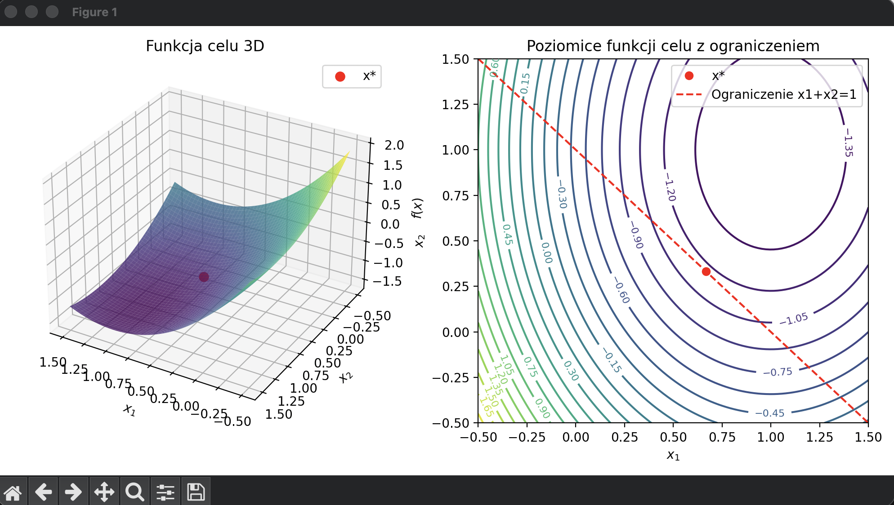

# Algorytmy i metody optymalizacji

## Projekt nr 2

### Bartosz Zaborowski 319996

## Zadanie 1: Programowanie kwadratowe z ograniczeniami równościowymi  

### Wariant 1: jedno ograniczenie równościowe

Rozważany jest problem programowania kwadratowego z jedną liniową więzią równościową postaci

\[
\min_{x \in \mathbb{R}^2} f(x) = \frac{1}{2} x^\top G x + t^\top x
\quad \text{przy ograniczeniu} \quad Ax = b,
\]

gdzie funkcja celu jest funkcją kwadratową, a macierz \(G\) jest dodatnio określona, co zapewnia wypukłość problemu.


### Wybór danych liczbowych problemu

Zgodnie z treścią zadania, wartości liczbowe macierzy oraz wektorów definiujących problem
programowania kwadratowego mogą zostać dobrane dowolnie, pod warunkiem zachowania
wypukłości zadania.

W niniejszym projekcie przyjęto problem o dwóch zmiennych decyzyjnych, którego funkcja celu
ma postać wypukłej funkcji kwadratowej. Wypukłość zapewniona jest przez wybór macierzy
\( G \in \mathbb{R}^{2 \times 2} \) jako macierzy symetrycznej dodatnio określonej.

Wybrane parametry problemu mają następującą postać:
\[
G =
\begin{bmatrix}
2 & 0 \\
0 & 1
\end{bmatrix},
\quad
t =
\begin{bmatrix}
-2 \\
-1
\end{bmatrix}.
\]

Macierz \(G\) jest diagonalna z dodatnimi elementami na przekątnej, co jednoznacznie
gwarantuje jej dodatnią określoność, a tym samym wypukłość funkcji celu.
Wektor \(t\) odpowiada za liniowy składnik funkcji celu i wpływa na położenie minimum
nieograniczonego.

Warianty zadania różnią się liczbą oraz postacią ograniczeń równościowych.
W pierwszym wariancie rozważane jest jedno ograniczenie liniowe:
\[
A =
\begin{bmatrix}
1 & 1
\end{bmatrix},
\quad
b = 1,
\]
co odpowiada warunkowi
\[
x_1 + x_2 = 1.
\]

Tak sformułowany problem posiada jednoznaczne rozwiązanie globalne, które może zostać
wyznaczone zarówno metodami analitycznymi, jak i numerycznymi.
Dobór prostych wartości liczbowych pozwala również na czytelną interpretację geometryczną
oraz przejrzystą wizualizację problemu.


### Definicja funkcji celu i ograniczenia

W niniejszym wariancie przyjęto następujące dane problemu:

\[
G =
\begin{bmatrix}
2 & 0 \\
0 & 1
\end{bmatrix},
\quad
t =
\begin{bmatrix}
-2 \\
-1
\end{bmatrix},
\]

oraz jedno ograniczenie równościowe opisane równaniem

\[
A =
\begin{bmatrix}
1 & 1
\end{bmatrix},
\quad
b = 1,
\]

co odpowiada warunkowi

\[
x_1 + x_2 = 1.
\]

Funkcja celu ma postać elipsoidalnej paraboloidy, a ograniczenie równościowe definiuje prostą w przestrzeni decyzyjnej \(\mathbb{R}^2\). Celem optymalizacji jest znalezienie punktu leżącego na tej prostej, dla którego wartość funkcji celu jest minimalna.

### (A) Rozwiązanie analityczne z wykorzystaniem mnożników Lagrange’a

W celu analitycznego rozwiązania zadania wprowadzono funkcję Lagrange’a

\[
\mathcal{L}(x,\lambda) = \frac{1}{2} x^\top G x + t^\top x + \lambda (Ax - b).
\]

Warunki konieczne optymalności (warunki KKT) przyjmują postać:

\[
\nabla_x \mathcal{L}(x,\lambda) = Gx + t + A^\top \lambda = 0,
\]
\[
Ax = b.
\]

Po podstawieniu danych otrzymujemy następujące macierze:

\[
\begin{bmatrix}
2 & 0 & 1 \\
0 & 1 & 1 \\
1 & 1 & 0
\end{bmatrix}
\] 
*
\[
\begin{bmatrix}
x_1 \\ x_2 \\ \lambda
\end{bmatrix}
\]

=

\[
\begin{bmatrix}
2 \\ 1 \\ 1
\end{bmatrix}
\]

Po rozpisaniu, z powyszych macierzy otrzymujemy następujący układ równań liniowych:

\[
\begin{cases}
2x_1 + \lambda = 2, \\
x_2 + \lambda = 1, \\
x_1 + x_2 = 1.
\end{cases}
\]

Rozwiązanie powyższego układu pozwala wyznaczyć punkt optymalny spełniający zarówno warunek stacjonarności, jak i ograniczenie równościowe.

### Rozwiązanie układu równań

1. Z trzeciego równania: \(x_2 = 1 - x_1\).  
2. Podstawiamy do drugiego: \(x_2 + \lambda = 1 \implies (1 - x_1) + \lambda = 1 \implies \lambda = x_1\).  
3. Podstawiamy \(\lambda = x_1\) do pierwszego równania: \(2x_1 + x_1 = 2 \implies 3x_1 = 2 \implies x_1 = \frac{2}{3}\).  
4. Wówczas \(x_2 = 1 - \frac{2}{3} = \frac{1}{3}\), \(\lambda = x_1 = \frac{2}{3}\).


### Punkt optymalny i wartość funkcji celu

Punkt optymalny i mnożnik Lagrange’a:

\[
x^\ast =
\begin{bmatrix}
x_1 \\ x_2
\end{bmatrix} =
\begin{bmatrix}
2/3 \\ 1/3
\end{bmatrix}, 
\quad
\lambda^\ast = 2/3
\]

Wartość funkcji celu obliczamy krok po kroku:

1. Wyznaczamy iloczyn \(G x^\ast\):

\[
G x^\ast =
\begin{bmatrix}
2 & 0 \\ 
0 & 1
\end{bmatrix}
\begin{bmatrix}
2/3 \\ 1/3
\end{bmatrix} =
\begin{bmatrix}
4/3 \\ 1/3
\end{bmatrix}
\]

2. Obliczamy \((x^\ast)^\top G x^\ast\):

\[
(x^\ast)^\top G x^\ast =
\begin{bmatrix} 2/3 & 1/3 \end{bmatrix} 
\begin{bmatrix} 4/3 \\ 1/3 \end{bmatrix} 
= 2/3 * 4/3 + 1/3 * 1/3 = 8/9 + 1/9 = 1
\]

3. Obliczamy \(\frac{1}{2} (x^\ast)^\top G x^\ast\):

\[
\frac{1}{2} (x^\ast)^\top G x^\ast = 0.5
\]

4. Obliczamy \(t^\top x^\ast\):

\[
t^\top x^\ast = 
\begin{bmatrix}-2 & -1\end{bmatrix} 
\begin{bmatrix}2/3 \\ 1/3\end{bmatrix} = -4/3 - 1/3 = -5/3 \approx -1.6667
\]

5. Sumujemy składniki funkcji celu:

\[
f(x^\ast) = \frac{1}{2} (x^\ast)^\top G x^\ast + t^\top x^\ast = 0.5 - 1.6667 = -1.1667
\]


**Podsumowanie:**
- **Punkt optymalny:** \(x^\ast = \begin{bmatrix}2/3 \\ 1/3\end{bmatrix}\)  
- **Wartość funkcji celu:** \(f(x^\ast) = -1.1667\)  
- **Mnożnik Lagrange’a:** \(\lambda^\ast = 2/3\)

### (B) Rozwiązanie metodą eliminacji zmiennych

Z ograniczenia równościowego:

\[
x_1 + x_2 = 1
\]

możemy wyeliminować jedną zmienną, np.:

\[
x_2 = 1 - x_1
\]


Podstawiając eliminowaną zmienną \(x_2 = 1 - x_1\) do funkcji celu, najpierw zapisujemy funkcję oryginalną:

\[
f(x_1, x_2) = \frac{1}{2} 
\begin{bmatrix} x_1 \\ x_2 \end{bmatrix}^\top
\begin{bmatrix} 2 & 0 \\ 0 & 1 \end{bmatrix}
\begin{bmatrix} x_1 \\ x_2 \end{bmatrix} 
+ 
\begin{bmatrix}-2 & -1\end{bmatrix} 
\begin{bmatrix} x_1 \\ x_2 \end{bmatrix}.
\]

Teraz podstawiamy \(x_2 = 1 - x_1\):

\[
\phi(x_1) = \frac{1}{2} 
\begin{bmatrix} x_1 \\ 1 - x_1 \end{bmatrix}^\top
\begin{bmatrix} 2 & 0 \\ 0 & 1 \end{bmatrix}
\begin{bmatrix} x_1 \\ 1 - x_1 \end{bmatrix}
+ 
\begin{bmatrix}-2 & -1\end{bmatrix} 
\begin{bmatrix} x_1 \\ 1 - x_1 \end{bmatrix}.
\]

Rozwijając mnożenie macierzy krok po kroku:

\[
\begin{bmatrix} 2 & 0 \\ 0 & 1 \end{bmatrix} 
\begin{bmatrix} x_1 \\ 1 - x_1 \end{bmatrix} 
\]

=

\[
\begin{bmatrix} 2 x_1 \\ 1 - x_1 \end{bmatrix}
\]

\[
\begin{bmatrix} x_1 & 1 - x_1 \end{bmatrix} 
\begin{bmatrix} 2 x_1 \\ 1 - x_1 \end{bmatrix} 
= 2 x_1^2 + (1 - x_1)^2 = 3 x_1^2 - 2 x_1 + 1
\]

\[
\frac{1}{2} (3 x_1^2 - 2 x_1 + 1) = \frac{3}{2} x_1^2 - x_1 + \frac{1}{2}
\]

\[
\begin{bmatrix}-2 & -1\end{bmatrix} 
\begin{bmatrix} x_1 \\ 1 - x_1 \end{bmatrix} = -2 x_1 - (1 - x_1) = - x_1 - 1
\]

\[
\phi(x_1) = \frac{3}{2} x_1^2 - x_1 + \frac{1}{2} - x_1 - 1 = \frac{3}{2} x_1^2 - 2 x_1 - \frac{1}{2}
\]

Teraz funkcja jest jednowymiarowa i gotowa do wyznaczenia minimum.
Rozpisując to:

\[
\begin{aligned}
\phi(x_1) &= \frac{1}{2} \left( 2 x_1^2 + (1 - x_1)^2 \right) + (-2)x_1 + (-1)(1 - x_1) \\
&= \frac{1}{2} \left( 2 x_1^2 + 1 - 2x_1 + x_1^2 \right) - 2x_1 - 1 + x_1 \\
&= \frac{1}{2} (3 x_1^2 - 2 x_1 + 1) - x_1 - 1 \\
&= \frac{3}{2} x_1^2 - x_1 + \frac{1}{2} - x_1 - 1 \\
&= \frac{3}{2} x_1^2 - 2 x_1 - \frac{1}{2}.
\end{aligned}
\]


Obliczamy pochodną i przyrównujemy do zera:

\[
\frac{d\phi}{dx_1} = 3 x_1 - 2 = 0 \quad \Rightarrow \quad x_1^\star = \frac{2}{3}.
\]

Zatem:

\[
x_2^\star = 1 - x_1^\star = 1 - \frac{2}{3} = \frac{1}{3}.
\]

Wartość funkcji celu w punkcie optymalnym:

\[
f(x^\star) = \phi(x_1^\star) = -1.1667.
\]


**Podsumowanie:**
- \(x^\star = \begin{bmatrix} 2/3 \\ 1/3 \end{bmatrix}\)  
- \(f(x^\star) = -1.1667\)


TODO
### (C) Metoda eliminacji uogólnionej z wykorzystaniem jądra macierzy \(A\)

Macierz ograniczeń ma postać

\[
A = \begin{bmatrix} 1 & 1 \end{bmatrix},
\]

a jej jądro jest jednowymiarowe i rozpięte przez wektor

\[
z = \begin{bmatrix} 1 \\ -1 \end{bmatrix},
\quad \text{dla którego } Az = 0.
\]

Jako punkt szczególny spełniający ograniczenie \(Ax=b\) przyjmujemy

\[
x_p = \begin{bmatrix} 1 \\ 0 \end{bmatrix},
\quad \text{ponieważ } Ax_p = 1.
\]

Każde dopuszczalne rozwiązanie można zapisać w postaci

\[
x = x_p + z\alpha =
\begin{bmatrix}
1 + \alpha \\ -\alpha
\end{bmatrix},
\quad \alpha \in \mathbb{R}.
\]

Po podstawieniu do funkcji celu otrzymujemy funkcję jednowymiarową:

\[
\phi(\alpha) =
\frac{1}{2}
\begin{bmatrix}
1+\alpha & -\alpha
\end{bmatrix}
\begin{bmatrix}
2 & 0 \\ 0 & 1
\end{bmatrix}
\begin{bmatrix}
1+\alpha \\ -\alpha
\end{bmatrix}
+
\begin{bmatrix}
-2 & -1
\end{bmatrix}
\begin{bmatrix}
1+\alpha \\ -\alpha
\end{bmatrix}.
\]

Po wykonaniu mnożeń otrzymujemy

\[
\phi(\alpha)
= \frac{1}{2} (2 + 4\alpha + 3\alpha^2) - (2 + \alpha)
= \frac{3}{2}\alpha^2 + \alpha - 1
\]

Warunek konieczny minimum:

\[
\frac{d\phi}{d\alpha} = 3\alpha + 1 = 0
\]

prowadzi do rozwiązania

\[
\alpha^\ast = -\frac{1}{3}.
\]

Podstawiając do postaci ogólnej otrzymujemy punkt optymalny

\[
x^\ast =
\begin{bmatrix}
1 - \frac{1}{3} \\
\frac{1}{3}
\end{bmatrix}
\]

=

\[
\begin{bmatrix}
\frac{2}{3} \\
\frac{1}{3}
\end{bmatrix}
\]

Otrzymane rozwiązanie jest zgodne z wynikami uzyskanymi metodą mnożników Lagrange’a oraz metodą eliminacji zmiennych.

### (D) Rozwiązanie numeryczne z wykorzystaniem solvera `quadprog`

Dla porównania zadanie rozwiązano również numerycznie w środowisku MATLAB z wykorzystaniem wbudowanego solvera `quadprog`. 

Problem programowania kwadratowego przy jednym ograniczeniu równościowym został zapisany w postaci standardowej:

\[
\min_x \frac{1}{2} x^\top G x + t^\top x
\quad \text{przy } Ax = b,
\]

gdzie:

\[
G = \begin{bmatrix} 2 & 0 \\ 0 & 1 \end{bmatrix}, \quad
t = \begin{bmatrix}-2 \\ -1 \end{bmatrix}, \quad
A = \begin{bmatrix} 1 & 1 \end{bmatrix}, \quad b = 1.
\]

W MATLAB zadanie zostało zaimplementowane w następujący sposób:

```matlab
function quadprog_TASK1

% Dane problemu
G = [2 0; 0 1];
t = [-2; -1];
Aeq = [1 1];
beq = 1;

% Opcje solvera
options = optimoptions('quadprog', 'Display', 'off');

% Rozwiązanie problemu
[x_star, fval] = quadprog(G, t, [], [], Aeq, beq, [], [], [], options);

% Wyświetlenie wyników
disp('Rozwiązanie numeryczne (quadprog):');
disp(x_star);
disp('Wartość funkcji celu:');
disp(fval);
end
```

### Wizualizacja problemu

Zgodnie z treścią zadania wykonano take wizualizacje:
- powierzchni funkcji celu \(f(x_1,x_2)\),
- wykresów poziomic funkcji celu,
- prostej opisującej ograniczenie równościowe,
- punktu optymalnego leżącego na zbiorze dopuszczalnym.

Wizualizacje zostały zapiane do pliku: /Visualisations/TASK1_Visualisations.png


Jak widzimy, wizualizacje potwierdzają, że punkt optymalny odpowiada minimum funkcji celu ograniczonemu do prostej \(x_1 + x_2 = 1\). Wykres trójwymiarowy przedstawia powierzchnię funkcji celu f(x) oraz punkt rozwiązania zadania z ograniczeniem równościowym.
Wykres poziomicowy ukazuje elipsy poziomic funkcji celu, prostą wynikającą z ograniczenia \(x_1 + x_2 = 1\). oraz punkt optymalny, który odpowiada styczności poziomicy z prostą ograniczenia.

### Wnioski

Wszystkie zastosowane metody: analityczna metoda mnożników Lagrange’a, eliminacja zmiennych, eliminacja uogólniona oraz rozwiązanie numeryczne prowadzą do tego samego rozwiązania optymalnego. Pokazuje to spójność teorii programowania kwadratowego oraz poprawność implementacji poszczególnych podejść.

## Wariant 2: dwa ograniczenia równościowe

### Wybór danych liczbowych problemu

Rozważane jest zadanie programowania kwadratowego w przestrzeni \(\mathbb{R}^2\) z funkcją celu postaci

\[
f(x) = \frac{1}{2} x^\top G x + t^\top x,
\]

gdzie macierz \(G \in \mathbb{R}^{2 \times 2}\) oraz wektor \(t \in \mathbb{R}^2\) dane są następująco:

\[
G =
\begin{bmatrix}
2 & 0 \\
0 & 1
\end{bmatrix},
\qquad
t =
\begin{bmatrix}
-2 \\
-1
\end{bmatrix}.
\]

Macierz \(G\) jest symetryczna oraz dodatnio określona, co gwarantuje istnienie jednoznacznego minimum funkcji celu.

### Definicja funkcji celu i ograniczeń

Zadanie optymalizacji rozważane jest przy dwóch liniowych ograniczeniach równościowych, które można zapisać w postaci macierzowej jako

\[
Ax = b,
\]

gdzie

\[
A =
\begin{bmatrix}
1 & 1 \\
1 & -1
\end{bmatrix},
\qquad
b =
\begin{bmatrix}
1 \\
0
\end{bmatrix}.
\]

Ograniczenia te odpowiadają układowi równań:

\[
\begin{cases}
x_1 + x_2 = 1, \\
x_1 - x_2 = 0.
\end{cases}
\]

Macierz \(A\) ma pełny rząd, co oznacza, że zbiór rozwiązań dopuszczalnych składa się z dokładnie jednego punktu w przestrzeni \(\mathbb{R}^2\).

.