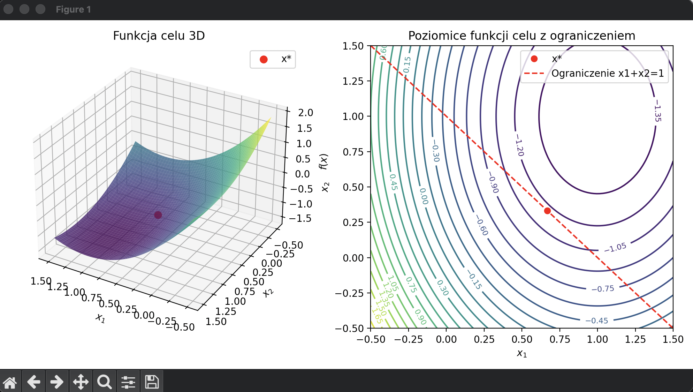
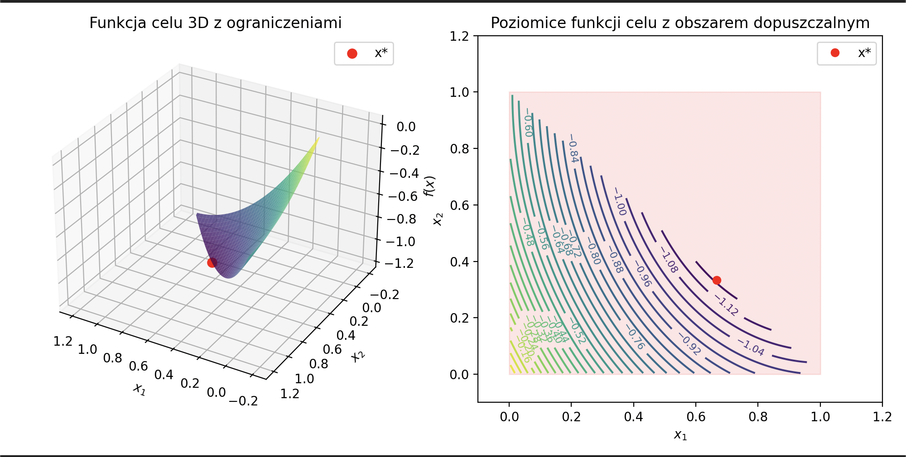

# Algorytmy i metody optymalizacji

## Projekt nr 2

### Bartosz Zaborowski 319996

## Zadanie 1: Programowanie kwadratowe z ograniczeniami równościowymi  

## Wariant 1: jedno ograniczenie równościowe

Rozważany jest problem programowania kwadratowego z jedną liniową więzią równościową postaci

\[
\min_{x \in \mathbb{R}^2} f(x) = \frac{1}{2} x^\top G x + t^\top x
\quad \text{przy ograniczeniu} \quad Ax = b,
\]

gdzie funkcja celu jest funkcją kwadratową, a macierz \(G\) jest dodatnio określona, co zapewnia wypukłość problemu.


### Wybór danych liczbowych problemu

Zgodnie z treścią zadania, wartości liczbowe macierzy oraz wektorów definiujących problem
programowania kwadratowego mogą zostać dobrane dowolnie, pod warunkiem zachowania
wypukłości zadania.

W niniejszym projekcie przyjęto problem o dwóch zmiennych decyzyjnych, którego funkcja celu
ma postać wypukłej funkcji kwadratowej. Wypukłość zapewniona jest przez wybór macierzy
\( G \in \mathbb{R}^{2 \times 2} \) jako macierzy symetrycznej dodatnio określonej.

Wybrane parametry problemu mają następującą postać:
\[
G =
\begin{bmatrix}
2 & 0 \\
0 & 1
\end{bmatrix},
\quad
t =
\begin{bmatrix}
-2 \\
-1
\end{bmatrix}.
\]

Macierz \(G\) jest diagonalna z dodatnimi elementami na przekątnej, co jednoznacznie
gwarantuje jej dodatnią określoność, a tym samym wypukłość funkcji celu.
Wektor \(t\) odpowiada za liniowy składnik funkcji celu i wpływa na położenie minimum
nieograniczonego.

Warianty zadania różnią się liczbą oraz postacią ograniczeń równościowych.
W pierwszym wariancie rozważane jest jedno ograniczenie liniowe:
\[
A =
\begin{bmatrix}
1 & 1
\end{bmatrix},
\quad
b = 1,
\]
co odpowiada warunkowi
\[
x_1 + x_2 = 1.
\]

Tak sformułowany problem posiada jednoznaczne rozwiązanie globalne, które może zostać
wyznaczone zarówno metodami analitycznymi, jak i numerycznymi.
Dobór prostych wartości liczbowych pozwala również na czytelną interpretację geometryczną
oraz przejrzystą wizualizację problemu.


### Definicja funkcji celu i ograniczenia

W niniejszym wariancie przyjęto następujące dane problemu:

\[
G =
\begin{bmatrix}
2 & 0 \\
0 & 1
\end{bmatrix},
\quad
t =
\begin{bmatrix}
-2 \\
-1
\end{bmatrix},
\]

oraz jedno ograniczenie równościowe opisane równaniem

\[
A =
\begin{bmatrix}
1 & 1
\end{bmatrix},
\quad
b = 1,
\]

co odpowiada warunkowi

\[
x_1 + x_2 = 1.
\]

Funkcja celu ma postać elipsoidalnej paraboloidy, a ograniczenie równościowe definiuje prostą w przestrzeni decyzyjnej \(\mathbb{R}^2\). Celem optymalizacji jest znalezienie punktu leżącego na tej prostej, dla którego wartość funkcji celu jest minimalna.

### (A) Rozwiązanie analityczne z wykorzystaniem mnożników Lagrange’a

W celu analitycznego rozwiązania zadania wprowadzono funkcję Lagrange’a

\[
\mathcal{L}(x,\lambda) = \frac{1}{2} x^\top G x + t^\top x + \lambda (Ax - b).
\]

Warunki konieczne optymalności (warunki KKT) przyjmują postać:

\[
\nabla_x \mathcal{L}(x,\lambda) = Gx + t + A^\top \lambda = 0,
\]
\[
Ax = b.
\]

Po podstawieniu danych otrzymujemy następujące macierze:

\[
\begin{bmatrix}
2 & 0 & 1 \\
0 & 1 & 1 \\
1 & 1 & 0
\end{bmatrix}
\] 
*
\[
\begin{bmatrix}
x_1 \\ x_2 \\ \lambda
\end{bmatrix}
\]

=

\[
\begin{bmatrix}
2 \\ 1 \\ 1
\end{bmatrix}
\]

Po rozpisaniu, z powyszych macierzy otrzymujemy następujący układ równań liniowych:

\[
\begin{cases}
2x_1 + \lambda = 2, \\
x_2 + \lambda = 1, \\
x_1 + x_2 = 1.
\end{cases}
\]

Rozwiązanie powyższego układu pozwala wyznaczyć punkt optymalny spełniający zarówno warunek stacjonarności, jak i ograniczenie równościowe.

#### Rozwiązanie układu równań

 \(x_2 = 1 - x_1\).  
\(x_2 + \lambda = 1 \implies (1 - x_1) + \lambda = 1 \implies \lambda = x_1\).  
\(\lambda = x_1\) do pierwszego równania: \(2x_1 + x_1 = 2 \implies 3x_1 = 2 \implies x_1 = \frac{2}{3}\).  
\(x_2 = 1 - \frac{2}{3} = \frac{1}{3}\), \(\lambda = x_1 = \frac{2}{3}\).


#### Punkt optymalny i wartość funkcji celu

Punkt optymalny i mnożnik Lagrange’a:

\[
x^\ast =
\begin{bmatrix}
x_1 \\ x_2
\end{bmatrix} =
\begin{bmatrix}
2/3 \\ 1/3
\end{bmatrix}, 
\quad
\lambda^\ast = 2/3
\]

Wartość funkcji celu obliczamy krok po kroku:

1. Wyznaczamy iloczyn \(G x^\ast\):

\[
G x^\ast =
\begin{bmatrix}
2 & 0 \\ 
0 & 1
\end{bmatrix}
\begin{bmatrix}
2/3 \\ 1/3
\end{bmatrix} =
\begin{bmatrix}
4/3 \\ 1/3
\end{bmatrix}
\]

2. Obliczamy \((x^\ast)^\top G x^\ast\):

\[
(x^\ast)^\top G x^\ast =
\begin{bmatrix} 2/3 & 1/3 \end{bmatrix} 
\begin{bmatrix} 4/3 \\ 1/3 \end{bmatrix} 
= 2/3 * 4/3 + 1/3 * 1/3 = 8/9 + 1/9 = 1
\]

3. Obliczamy \(\frac{1}{2} (x^\ast)^\top G x^\ast\):

\[
\frac{1}{2} (x^\ast)^\top G x^\ast = 0.5
\]

4. Obliczamy \(t^\top x^\ast\):

\[
t^\top x^\ast = 
\begin{bmatrix}-2 & -1\end{bmatrix} 
\begin{bmatrix}2/3 \\ 1/3\end{bmatrix} = -4/3 - 1/3 = -5/3 \approx -1.6667
\]

5. Sumujemy składniki funkcji celu:

\[
f(x^\ast) = \frac{1}{2} (x^\ast)^\top G x^\ast + t^\top x^\ast = 0.5 - 1.6667 = -1.1667
\]

- **Punkt optymalny:** \(x^\ast = \begin{bmatrix}2/3 \\ 1/3\end{bmatrix}\)  
- **Wartość funkcji celu:** \(f(x^\ast) = -1.1667\)  
- **Mnożnik Lagrange’a:** \(\lambda^\ast = 2/3\)

### (B) Rozwiązanie metodą eliminacji zmiennych

Z ograniczenia równościowego:

\[
x_1 + x_2 = 1
\]

możemy wyeliminować jedną zmienną, np.:

\[
x_2 = 1 - x_1
\]


Podstawiając eliminowaną zmienną \(x_2 = 1 - x_1\) do funkcji celu, najpierw zapisujemy funkcję oryginalną:

\[
f(x_1, x_2) = \frac{1}{2} 
\begin{bmatrix} x_1 \\ x_2 \end{bmatrix}^\top
\begin{bmatrix} 2 & 0 \\ 0 & 1 \end{bmatrix}
\begin{bmatrix} x_1 \\ x_2 \end{bmatrix} 
+ 
\begin{bmatrix}-2 & -1\end{bmatrix} 
\begin{bmatrix} x_1 \\ x_2 \end{bmatrix}.
\]

Teraz podstawiamy \(x_2 = 1 - x_1\):

\[
\phi(x_1) = \frac{1}{2} 
\begin{bmatrix} x_1 \\ 1 - x_1 \end{bmatrix}^\top
\begin{bmatrix} 2 & 0 \\ 0 & 1 \end{bmatrix}
\begin{bmatrix} x_1 \\ 1 - x_1 \end{bmatrix}
+ 
\begin{bmatrix}-2 & -1\end{bmatrix} 
\begin{bmatrix} x_1 \\ 1 - x_1 \end{bmatrix}.
\]

Rozwijając mnożenie macierzy krok po kroku:

\[
\begin{bmatrix} 2 & 0 \\ 0 & 1 \end{bmatrix} 
\begin{bmatrix} x_1 \\ 1 - x_1 \end{bmatrix} 
\]

=

\[
\begin{bmatrix} 2 x_1 \\ 1 - x_1 \end{bmatrix}
\]

\[
\begin{bmatrix} x_1 & 1 - x_1 \end{bmatrix} 
\begin{bmatrix} 2 x_1 \\ 1 - x_1 \end{bmatrix} 
= 2 x_1^2 + (1 - x_1)^2 = 3 x_1^2 - 2 x_1 + 1
\]

\[
\frac{1}{2} (3 x_1^2 - 2 x_1 + 1) = \frac{3}{2} x_1^2 - x_1 + \frac{1}{2}
\]

\[
\begin{bmatrix}-2 & -1\end{bmatrix} 
\begin{bmatrix} x_1 \\ 1 - x_1 \end{bmatrix} = -2 x_1 - (1 - x_1) = - x_1 - 1
\]

\[
\phi(x_1) = \frac{3}{2} x_1^2 - x_1 + \frac{1}{2} - x_1 - 1 = \frac{3}{2} x_1^2 - 2 x_1 - \frac{1}{2}
\]

Teraz funkcja jest jednowymiarowa i gotowa do wyznaczenia minimum.
Rozpisując to:

\[
\begin{aligned}
\phi(x_1) &= \frac{1}{2} \left( 2 x_1^2 + (1 - x_1)^2 \right) + (-2)x_1 + (-1)(1 - x_1) \\
&= \frac{1}{2} \left( 2 x_1^2 + 1 - 2x_1 + x_1^2 \right) - 2x_1 - 1 + x_1 \\
&= \frac{1}{2} (3 x_1^2 - 2 x_1 + 1) - x_1 - 1 \\
&= \frac{3}{2} x_1^2 - x_1 + \frac{1}{2} - x_1 - 1 \\
&= \frac{3}{2} x_1^2 - 2 x_1 - \frac{1}{2}.
\end{aligned}
\]


Obliczamy pochodną i przyrównujemy do zera:

\[
\frac{d\phi}{dx_1} = 3 x_1 - 2 = 0 \quad \Rightarrow \quad x_1^\star = \frac{2}{3}.
\]

Zatem:

\[
x_2^\star = 1 - x_1^\star = 1 - \frac{2}{3} = \frac{1}{3}.
\]

Wartość funkcji celu w punkcie optymalnym:

\[
f(x^\star) = \phi(x_1^\star) = -1.1667.
\]

- \(x^\star = \begin{bmatrix} 2/3 \\ 1/3 \end{bmatrix}\)  
- \(f(x^\star) = -1.1667\)


### (C) Metoda eliminacji uogólnionej z wykorzystaniem jądra macierzy \(A\)

Macierz ograniczeń ma postać

\[
A = \begin{bmatrix} 1 & 1 \end{bmatrix},
\]

a jej jądro jest jednowymiarowe i rozpięte przez wektor

\[
z = \begin{bmatrix} 1 \\ -1 \end{bmatrix},
\quad \text{dla którego } Az = 0.
\]

Jako punkt szczególny spełniający ograniczenie \(Ax=b\) przyjmujemy

\[
x_p = \begin{bmatrix} 1 \\ 0 \end{bmatrix},
\quad \text{ponieważ } Ax_p = 1.
\]

Każde dopuszczalne rozwiązanie można zapisać w postaci

\[
x = x_p + z\alpha =
\begin{bmatrix}
1 + \alpha \\ -\alpha
\end{bmatrix},
\quad \alpha \in \mathbb{R}.
\]

Po podstawieniu do funkcji celu otrzymujemy funkcję jednowymiarową:

\[
\phi(\alpha) =
\frac{1}{2}
\begin{bmatrix}
1+\alpha & -\alpha
\end{bmatrix}
\begin{bmatrix}
2 & 0 \\ 0 & 1
\end{bmatrix}
\begin{bmatrix}
1+\alpha \\ -\alpha
\end{bmatrix}
+
\begin{bmatrix}
-2 & -1
\end{bmatrix}
\begin{bmatrix}
1+\alpha \\ -\alpha
\end{bmatrix}.
\]

Po wykonaniu mnożeń otrzymujemy

\[
\phi(\alpha)
= \frac{1}{2} (2 + 4\alpha + 3\alpha^2) - (2 + \alpha)
= \frac{3}{2}\alpha^2 + \alpha - 1
\]

Warunek konieczny minimum:

\[
\frac{d\phi}{d\alpha} = 3\alpha + 1 = 0
\]

prowadzi do rozwiązania

\[
\alpha^\ast = -\frac{1}{3}.
\]

Podstawiając do postaci ogólnej otrzymujemy punkt optymalny

\[
x^\ast =
\begin{bmatrix}
1 - \frac{1}{3} \\
\frac{1}{3}
\end{bmatrix}
\]

=

\[
\begin{bmatrix}
\frac{2}{3} \\
\frac{1}{3}
\end{bmatrix}
\]

Otrzymane rozwiązanie jest zgodne z wynikami uzyskanymi metodą mnożników Lagrange’a oraz metodą eliminacji zmiennych.

### (D) Rozwiązanie numeryczne z wykorzystaniem solvera `quadprog`

Dla porównania zadanie rozwiązano również numerycznie w środowisku MATLAB z wykorzystaniem wbudowanego solvera `quadprog`. 

Problem programowania kwadratowego przy jednym ograniczeniu równościowym został zapisany w postaci standardowej:

\[
\min_x \frac{1}{2} x^\top G x + t^\top x
\quad \text{przy } Ax = b,
\]

gdzie:

\[
G = \begin{bmatrix} 2 & 0 \\ 0 & 1 \end{bmatrix}, \quad
t = \begin{bmatrix}-2 \\ -1 \end{bmatrix}, \quad
A = \begin{bmatrix} 1 & 1 \end{bmatrix}, \quad b = 1.
\]

W MATLAB zadanie zostało zaimplementowane w następujący sposób:

```matlab
function quadprog_TASK1

% Dane problemu
G = [2 0; 0 1];
t = [-2; -1];
Aeq = [1 1];
beq = 1;

% Opcje solvera
options = optimoptions('quadprog', 'Display', 'off');

% Rozwiązanie problemu
[x_star, fval] = quadprog(G, t, [], [], Aeq, beq, [], [], [], options);

% Wyświetlenie wyników
disp('Rozwiązanie numeryczne (quadprog):');
disp(x_star);
disp('Wartość funkcji celu:');
disp(fval);
end
```
Rozwiązanie uzyskane z wykorzystaniem solvera `quadprog` wskazuje, że punkt optymalny zadania programowania kwadratowego z jednym ograniczeniem równościowym ma postać

\[
x^\ast =
\begin{bmatrix}
0.6667 \\
0.3333
\end{bmatrix},
\]

co jest zgodne (z dokładnością numeryczną) z rozwiązaniem analitycznym
\(
x^\ast = \begin{bmatrix} \frac{2}{3} \\ \frac{1}{3} \end{bmatrix}
\)
wyznaczonym metodą mnożników Lagrange’a oraz metodami eliminacyjnymi.

Wartość funkcji celu w punkcie optymalnym wynosi

\[
f(x^\ast) = -1.1667,
\]

co oznacza minimalną możliwą wartość funkcji kwadratowej przy spełnieniu ograniczenia
\(x_1 + x_2 = 1\).

Zgodność wyników uzyskanych metodą numeryczną z rezultatami analitycznymi potwierdza poprawność sformułowania problemu, implementacji solvera oraz przeprowadzonych obliczeń teoretycznych.


### Wizualizacja problemu

Zgodnie z treścią zadania wykonano take wizualizacje:
- powierzchni funkcji celu \(f(x_1,x_2)\),
- wykresów poziomic funkcji celu,
- prostej opisującej ograniczenie równościowe,
- punktu optymalnego leżącego na zbiorze dopuszczalnym.

Wizualizacje zostały zapiane do pliku: /Visualisations/TASK1_Visualisations.png


Jak widzimy, wizualizacje potwierdzają, że punkt optymalny odpowiada minimum funkcji celu ograniczonemu do prostej \(x_1 + x_2 = 1\). Wykres trójwymiarowy przedstawia powierzchnię funkcji celu f(x) oraz punkt rozwiązania zadania z ograniczeniem równościowym.
Wykres poziomicowy ukazuje elipsy poziomic funkcji celu, prostą wynikającą z ograniczenia \(x_1 + x_2 = 1\). oraz punkt optymalny, który odpowiada styczności poziomicy z prostą ograniczenia.

### Wnioski

Wszystkie zastosowane metody: analityczna metoda mnożników Lagrange’a, eliminacja zmiennych, eliminacja uogólniona oraz rozwiązanie numeryczne prowadzą do tego samego rozwiązania optymalnego. Pokazuje to spójność teorii programowania kwadratowego oraz poprawność implementacji poszczególnych podejść.

## Wariant 2: dwa ograniczenia równościowe

### Wybór danych liczbowych problemu

Rozważane jest zadanie programowania kwadratowego w przestrzeni \(\mathbb{R}^2\) z funkcją celu postaci

\[
f(x) = \frac{1}{2} x^\top G x + t^\top x,
\]

gdzie macierz \(G \in \mathbb{R}^{2 \times 2}\) oraz wektor \(t \in \mathbb{R}^2\) dane są następująco:

\[
G =
\begin{bmatrix}
2 & 0 \\
0 & 1
\end{bmatrix},
\qquad
t =
\begin{bmatrix}
-2 \\
-1
\end{bmatrix}.
\]

Macierz \(G\) jest symetryczna oraz dodatnio określona, co gwarantuje istnienie jednoznacznego minimum funkcji celu.

### Definicja funkcji celu i ograniczeń

Zadanie optymalizacji rozważane jest przy dwóch liniowych ograniczeniach równościowych, które można zapisać w postaci macierzowej jako

\[
Ax = b,
\]

gdzie

\[
A =
\begin{bmatrix}
1 & 1 \\
1 & -1
\end{bmatrix},
\qquad
b =
\begin{bmatrix}
1 \\
0
\end{bmatrix}.
\]

Ograniczenia te odpowiadają układowi równań:

\[
\begin{cases}
x_1 + x_2 = 1, \\
x_1 - x_2 = 0.
\end{cases}
\]

Macierz \(A\) ma pełny rząd, co oznacza, że zbiór rozwiązań dopuszczalnych składa się z dokładnie jednego punktu w przestrzeni \(\mathbb{R}^2\).

### (A) Rozwiązanie analityczne z wykorzystaniem mnożników Lagrange’a

W celu analitycznego rozwiązania zadania z dwoma ograniczeniami równościowymi wprowadza się funkcję Lagrange’a postaci

\[
\mathcal{L}(x, \lambda) =
\frac{1}{2} x^\top G x + t^\top x + \lambda^\top (Ax - b),
\]

gdzie \(x \in \mathbb{R}^2\) oraz \(\lambda \in \mathbb{R}^2\) jest wektorem mnożników Lagrange’a.

Warunki konieczne optymalności (warunki KKT) przyjmują postać:

\[
\nabla_x \mathcal{L}(x, \lambda) = Gx + t + A^\top \lambda = 0,
\]

\[
Ax = b.
\]

Po podstawieniu danych zadania otrzymujemy następujące równania.

Warunek stacjonarności:

\[
Gx + t + A^\top \lambda = 0
\]

co po rozpisaniu daje układ równań skalarnych:

\[
2x_1 - 2 + \lambda_1 + \lambda_2 = 0
\]

\[
x_2 - 1 + \lambda_1 - \lambda_2 = 0
\]

Ograniczenia równościowe mają postać:

\[
x_1 + x_2 = 1
\]

\[
x_1 - x_2 = 0
\]

Powyższe równania można zebrać w postaci układu liniowego:

\[
\begin{cases}
2x_1 + \lambda_1 + \lambda_2 = 2, \\
x_2 + \lambda_1 - \lambda_2 = 1, \\
x_1 + x_2 = 1, \\
x_1 - x_2 = 0.
\end{cases}
\]

Rozwiązanie tego układu prowadzi do jednoznacznego punktu optymalnego.

Rozwiązujemy więc układ równań:

\[
\begin{cases}
2x_1 + \lambda_1 + \lambda_2 = 2, \\
x_2 + \lambda_1 - \lambda_2 = 1, \\
x_1 + x_2 = 1, \\
x_1 - x_2 = 0.
\end{cases}
\]

Z ostatniego równania wynika bezpośrednio:

\[
x_1 = x_2.
\]

Podstawiając do trzeciego równania otrzymujemy:

\[
x_1 + x_1 = 1 \quad \Rightarrow \quad 2x_1 = 1
\]

\[
x_1 = \frac{1}{2}.
\]

Stąd:

\[
x_2 = \frac{1}{2}.
\]

Podstawiamy wyznaczone wartości zmiennych decyzyjnych do pierwszych dwóch równań:

Pierwsze równanie:

\[
2 \cdot \frac{1}{2} + \lambda_1 + \lambda_2 = 2
\]

\[
1 + \lambda_1 + \lambda_2 = 2
\]

\[
\lambda_1 + \lambda_2 = 1.
\]

Drugie równanie:

\[
\frac{1}{2} + \lambda_1 - \lambda_2 = 1
\]

\[
\lambda_1 - \lambda_2 = \frac{1}{2}.
\]

Otrzymujemy układ równań liniowych względem mnożników Lagrange’a:

\[
\begin{cases}
\lambda_1 + \lambda_2 = 1, \\
\lambda_1 - \lambda_2 = \frac{1}{2}.
\end{cases}
\]

Dodając oba równania stronami:

\[
2\lambda_1 = \frac{3}{2}
\]

\[
\lambda_1 = \frac{3}{4}.
\]

Podstawiając do pierwszego równania:

\[
\lambda_2 = 1 - \frac{3}{4} = \frac{1}{4}.
\]

Ostatecznie otrzymujemy:

\[
x^\ast =
\begin{bmatrix}
\frac{1}{2} \\
\frac{1}{2}
\end{bmatrix},
\quad
\lambda^\ast =
\begin{bmatrix}
\frac{3}{4} \\
\frac{1}{4}
\end{bmatrix}.
\]


Po rozwiązaniu powyższego układu równań otrzymujemy jako odpowieź następujące rozwiązanie:

\[
x^\ast =
\begin{bmatrix}
\frac{1}{2} \\
\frac{1}{2}
\end{bmatrix},
\qquad
\lambda^\ast =
\begin{bmatrix}
\frac{3}{2} \\
\frac{1}{2}
\end{bmatrix}.
\]

Otrzymany punkt spełnia oba ograniczenia równościowe oraz warunek stacjonarności, a ze względu na dodatnią określoność macierzy \(G\) stanowi globalne minimum rozważanego zadania.

#### Wartość funkcji celu w punkcie optymalnym

Z poprzednich obliczeń otrzymano punkt optymalny:

\[
x^\ast =
\begin{bmatrix}
\frac{1}{2} \\
\frac{1}{2}
\end{bmatrix}.
\]

Najpierw obliczamy iloczyn \(G x^\ast\).

\[
G =
\begin{bmatrix}
2 & 0 \\
0 & 1
\end{bmatrix}
\]

\[
x^\ast =
\begin{bmatrix}
\frac{1}{2} \\
\frac{1}{2}
\end{bmatrix}
\]

\[
G x^\ast =
\begin{bmatrix}
1 \\
\frac{1}{2}
\end{bmatrix}
\]

Następnie obliczamy iloczyn skalarny \((x^\ast)^\top G x^\ast\).

\[
(x^\ast)^\top =
\begin{bmatrix}
\frac{1}{2} & \frac{1}{2}
\end{bmatrix}
\]

\[
(x^\ast)^\top G x^\ast =
\frac{1}{2} \cdot 1 + \frac{1}{2} \cdot \frac{1}{2}
\]

\[
(x^\ast)^\top G x^\ast =
\frac{3}{4}
\]
Stąd:

\[
\frac{1}{2} (x^\ast)^\top G x^\ast = \frac{3}{8}.
\]

Obliczamy składnik liniowy funkcji celu.

\[
t^\top =
\begin{bmatrix}
-2 & -1
\end{bmatrix}
\]

\[
x^\ast =
\begin{bmatrix}
\frac{1}{2} \\
\frac{1}{2}
\end{bmatrix}
\]

\[
t^\top x^\ast =
-2 \cdot \frac{1}{2} + (-1) \cdot \frac{1}{2}
\]

\[
t^\top x^\ast =
-1 - \frac{1}{2}
\]

\[
t^\top x^\ast =
-\frac{3}{2}
\]
Ostatecznie wartość funkcji celu w punkcie optymalnym wynosi:

\[
f(x^\ast) = \frac{3}{8} - \frac{3}{2} = -\frac{9}{8} = -1.125.
\]


### (B) Rozwiązanie metodą eliminacji zmiennych

W wariancie z dwoma ograniczeniami równościowymi zbiór dopuszczalny jest jednoelementowy.
Ograniczenia mają postać:

\[
\begin{cases}
x_1 + x_2 = 1, \\
x_1 - x_2 = 0.
\end{cases}
\]

Z drugiego równania wynika bezpośrednio:

\[
x_1 = x_2.
\]

Podstawiając do pierwszego ograniczenia otrzymujemy:

\[
x_1 + x_1 = 1 \quad \Rightarrow \quad 2x_1 = 1
\]

\[
x_1 = \frac{1}{2}.
\]

Stąd:

\[
x_2 = \frac{1}{2}.
\]

Ponieważ oba ograniczenia jednoznacznie wyznaczają punkt dopuszczalny, nie zachodzi potrzeba
minimalizacji funkcji jednowymiarowej. Rozwiązanie jest jedyne i automatycznie spełnia warunki
optymalności.

Ostatecznie otrzymujemy punkt:

\[
x^\ast =
\begin{bmatrix}
\frac{1}{2} \\
\frac{1}{2}
\end{bmatrix}.
\]

Wartość funkcji celu w tym punkcie wynosi:

\[
f(x^\ast) =
\frac{1}{2}
\begin{bmatrix}
\frac{1}{2} & \frac{1}{2}
\end{bmatrix}
\begin{bmatrix}
2 & 0 \\ 0 & 1
\end{bmatrix}
\begin{bmatrix}
\frac{1}{2} \\ \frac{1}{2}
\end{bmatrix}
+
\begin{bmatrix}
-2 & -1
\end{bmatrix}
\begin{bmatrix}
\frac{1}{2} \\ \frac{1}{2}
\end{bmatrix}
= -1.125.
\]

### (C) Metoda eliminacji uogólnionej z wykorzystaniem jądra macierzy \(A\)

Dla zadania z dwoma ograniczeniami równościowymi

\[
A =
\begin{bmatrix}
1 & 1 \\
1 & -1
\end{bmatrix}, \quad
b =
\begin{bmatrix}
1 \\
0
\end{bmatrix},
\]

jądro macierzy \(A\) jest jednowymiarowe i rozpięte przez wektor

\[
z =
\begin{bmatrix}
1 \\
-1
\end{bmatrix}, \quad \text{dla którego } Az = 0.
\]

Jako punkt szczególny spełniający ograniczenie \(Ax = b\) możemy przyjąć:

\[
x_p =
\begin{bmatrix}
1/2 \\
1/2
\end{bmatrix}, \quad \text{ponieważ } Ax_p = b.
\]

Każde dopuszczalne rozwiązanie można zapisać w postaci:

\[
x = x_p + z \alpha =
\begin{bmatrix}
1/2 + \alpha \\
1/2 - \alpha
\end{bmatrix}, \quad \alpha \in \mathbb{R}.
\]

Podstawiając tę postać do funkcji celu

\[
f(x) = \frac{1}{2} x^\top G x + t^\top x,
\]

otrzymujemy funkcję jednowymiarową względem \(\alpha\):

\[
\begin{aligned}
\phi(\alpha) &= \frac{1}{2} 
\begin{bmatrix} 1/2 + \alpha \\ 1/2 - \alpha \end{bmatrix}^\top
\begin{bmatrix} 2 & 0 \\ 0 & 1 \end{bmatrix}
\begin{bmatrix} 1/2 + \alpha \\ 1/2 - \alpha \end{bmatrix}
+ 
\begin{bmatrix}-2 & -1\end{bmatrix} 
\begin{bmatrix} 1/2 + \alpha \\ 1/2 - \alpha \end{bmatrix} \\
&= \frac{1}{2} \left( 2(1/2 + \alpha)^2 + (1/2 - \alpha)^2 \right) -2(1/2 + \alpha) - (1/2 - \alpha) \\
&= \frac{3}{2} \alpha^2 - 1.
\end{aligned}
\]

Warunek konieczny minimum:

\[
\frac{d\phi}{d\alpha} = 3 \alpha = 0 \quad \Rightarrow \quad \alpha^\ast = 0.
\]

Podstawiając do ogólnej postaci rozwiązania otrzymujemy punkt optymalny:

\[
x^\ast = x_p + z \alpha^\ast =
\begin{bmatrix}
1/2 \\
1/2
\end{bmatrix}.
\]

Wartość funkcji celu w punkcie optymalnym:

\[
f(x^\ast) = \phi(0) = -1.125.
\]

- **Punkt optymalny:** \(x^\ast = \begin{bmatrix} 1/2 \\ 1/2 \end{bmatrix}\)  
- **Wartość funkcji celu:** \(f(x^\ast) = -1.125\)

### (D) Rozwiązanie numeryczne z wykorzystaniem solvera `quadprog`

Dla porównania, zadanie zostało rozwiązane również numerycznie z wykorzystaniem wbudowanego solvera `quadprog` w MATLABie, przy uwzględnieniu dwóch ograniczeń równościowych:

\[
A =
\begin{bmatrix}
1 & 1 \\
1 & -1
\end{bmatrix},
\quad
b =
\begin{bmatrix}
1 \\
0
\end{bmatrix}.
\]

Rozwiązanie numeryczne uzyskano następującym kodem MATLAB:

```matlab
function quadprog_TASK2
% quadprog_TASK2 - rozwiązanie numeryczne zadania QP z dwoma ograniczeniami

% Dane problemu
G = [2 0; 0 1];
t = [-2; -1];
Aeq = [1 1; 1 -1];
beq = [1; 0];

% Opcje solvera
options = optimoptions('quadprog', 'Display', 'off');

% Rozwiązanie problemu
[x_star, fval] = quadprog(G, t, [], [], Aeq, beq, [], [], [], options);

% Wyświetlenie wyników
disp('Rozwiązanie numeryczne (quadprog):');
disp(x_star);
disp('Wartość funkcji celu:');
disp(fval);
end
```
Otrzymane rozwiązanie numeryczne dla wariantu z dwoma ograniczeniami równościowymi przedstawia się następująco:

```
Rozwiązanie numeryczne (quadprog):
    0.5000
    0.5000

Wartość funkcji celu:
   -1.1250
```

Interpretacja wyników:
- **Punkt optymalny:** \(x^\ast = [0.5, 0.5]\). Oznacza to, że minimalna wartość funkcji celu jest osiągana, gdy obie zmienne decyzyjne są równe 0.5.  
- **Wartość funkcji celu:** \(f(x^\ast) = -1.125\), co jest zgodne z wynikami uzyskanymi metodami analitycznymi oraz metodą eliminacji zmiennych i metodą jądra macierzy \(A\).  
- **Wnioski:** Wynik potwierdza poprawność przeprowadzonych obliczeń i zgodność wszystkich zastosowanych metod optymalizacji. Minimalizacja funkcji kwadratowej z dwoma liniowymi ograniczeniami równościowymi prowadzi do symetrycznego rozwiązania w tym przypadku, co jest intuicyjne biorąc pod uwagę symetrię ograniczeń.

### Wizualizacja problemu

Zgodnie z treścią zadania wykonano take wizualizacje:
- powierzchni funkcji celu \(f(x_1,x_2)\),
- wykresów poziomic funkcji celu,
- prostej opisującej ograniczenie równościowe,
- punktu optymalnego leżącego na zbiorze dopuszczalnym.

Wizualizacje zostały zapiane do pliku: /Visualisations/TASK1_Visualisations.png


Jak widzimy, wizualizacje potwierdzają, że punkt optymalny odpowiada minimum funkcji celu przy jednoczesnym spełnieniu obu ograniczeń równościowych x1 + x2 = 1 oraz x1 - x2 = 0. Wykres trójwymiarowy przedstawia powierzchnię funkcji celu f(x) oraz punkt rozwiązania zadania z ograniczeniami.
Wykres poziomicowy ukazuje elipsy poziomic funkcji celu, a przecięcie linii wynikających z ograniczeń wskazuje dopuszczalny obszar rozwiązań. Punkt optymalny znajduje się dokładnie w miejscu przecięcia tych linii, co wizualnie potwierdza spełnienie warunków ograniczeń i osiągnięcie minimum funkcji celu.


### Zadanie 1 - Wnioski całościowe

We wszystkich rozważonych wariantach zadania (jedno i dwa ograniczenia równościowe) uzyskano spójne wyniki przy zastosowaniu różnych metod optymalizacji: analitycznego wyznaczenia punktu stacjonarnego z wykorzystaniem mnożników Lagrange’a, metody eliminacji zmiennych, metody eliminacji uogólnionej z wykorzystaniem jądra macierzy ograniczeń oraz solvera numerycznego `quadprog`.  

Dla wariantu z jednym ograniczeniem równościowym wszystkie metody prowadzą do punktu optymalnego \(x^\ast = [2/3, 1/3]\) z wartością funkcji celu \(f(x^\ast) = -1.1667\). Rozwiązanie to spełnia warunek równościowy \(x_1 + x_2 = 1\) i odpowiada intuicyjnej interpretacji geometrycznej, minimum funkcji kwadratowej na prostej ograniczenia.  

Dla wariantu z dwoma ograniczeniami równościowymi, bardziej ograniczającym przestrzeń dopuszczalnych rozwiązań, wszystkie metody doprowadziły do punktu optymalnego \(x^\ast = [0.5, 0.5]\) z wartością funkcji celu \(f(x^\ast) = -1.125\). Symetryczne rozmieszczenie zmiennych wynika bezpośrednio z symetrii przyjętych ograniczeń.  

Wyniki te pokazują, że:  
- Różne metody analityczne i numeryczne dają spójne rozwiązania w zadaniach wypukłych;  
- Wprowadzenie większej liczby ograniczeń równościowych zmienia położenie minimum funkcji, zmniejszając przestrzeń dopuszczalną;  
- Solver `quadprog` w MATLAB umożliwia szybkie i poprawne wyznaczenie punktu optymalnego nawet przy większej liczbie ograniczeń;  
- Wizualizacja funkcji celu oraz ograniczeń w przestrzeni \(\mathbb{R}^2\) pozwala łatwo zweryfikować zgodność rozwiązań i intuicyjnie ocenić położenie minimum względem prostych ograniczeń.  

Podsumowując, zadanie potwierdza poprawność stosowanych metod optymalizacji kwadratowej z liniowymi ograniczeniami równościowymi oraz pokazuje, że rozwiązania analityczne i numeryczne są ze sobą zgodne.

## Zadanie 2: Programowanie kwadratowe z ograniczeniami nierównościowymi

### Wybór danych liczbowych problemu

W zadaniu rozważane jest programowanie kwadratowe w przestrzeni dwuwymiarowej.
Przyjęto następujące dane liczbowe problemu:

\[
G =
\begin{bmatrix}
2 & 0 \\
0 & 1
\end{bmatrix},
\quad
t =
\begin{bmatrix}
-2 \\
-1
\end{bmatrix}.
\]

Macierz \(G\) jest symetryczna i dodatnio określona, co gwarantuje wypukłość
funkcji celu oraz istnienie jednoznacznego minimum globalnego.

Jako zbiór ograniczeń nierównościowych przyjęto:

\[
A =
\begin{bmatrix}
1 & 1 \\
-1 & 0 \\
0 & -1
\end{bmatrix},
\quad
b =
\begin{bmatrix}
1 \\
0 \\
0
\end{bmatrix}.
\]

Powyższe ograniczenia definiują obszar dopuszczalny w postaci trójkąta
w przestrzeni \(\mathbb{R}^2\).

### Definicja funkcji celu i ograniczeń

Rozważane zadanie optymalizacji ma postać:

\[
\min_{x \in \mathbb{R}^2}
\quad
f(x) = \frac{1}{2} x^\top G x + t^\top x,
\]

przy ograniczeniach nierównościowych:

\[
Ax \le b.
\]

Oznacza to następujący układ nierówności:

\[
\begin{cases}
x_1 + x_2 \le 1, \\
x_1 \ge 0, \\
x_2 \ge 0.
\end{cases}
\]

Funkcja celu jest wypukłą elipsoidalną paraboloidą, natomiast zbiór dopuszczalny
stanowi wypukły wielokąt w postaci trójkąta w pierwszej ćwiartce układu
współrzędnych.

Celem zadania jest znalezienie punktu \(x^\ast\) należącego do tego obszaru,
dla którego wartość funkcji celu jest minimalna.

### (A) Rozwiązanie metodą ograniczeń aktywnych

Metoda ograniczeń aktywnych polega na iteracyjnym rozwiązywaniu problemu
przyjmując tymczasowo pewną podgrupę ograniczeń jako aktywne (równania), a następnie
aktualizowaniu zestawu ograniczeń aktywnych do momentu znalezienia punktu spełniającego
warunki KKT dla całego zbioru ograniczeń nierównościowych.

#### Identyfikacja ograniczeń aktywnych
Na starcie przyjmujemy, że ograniczenia aktywne to te, które w punkcie startowym
spełniają się jako równości. Przyjmijmy punkt początkowy w wnętrzu obszaru dopuszczalnego jako przykladowo:

\[
x^{(0)} = 
\begin{bmatrix}
0.5 \\ 0.25
\end{bmatrix}.
\]

Dla tego punktu ograniczenia aktywne to:

\[
x_1 + x_2 \le 1 \quad \text{(nierówność aktywna, bo } 0.5 + 0.25 < 1\text{)},
\]
\[
x_1 \ge 0, \quad x_2 \ge 0 \quad \text{(nieaktywne w punkcie startowym)}.
\]

#### Rozwiązanie problemu przy ograniczeniach aktywnych jako równaniach
Tymczasowo traktujemy nierówności jako równania:

\[
x_1 + x_2 = 1
\]

i rozwiązujemy problem kwadratowy z jednym ograniczeniem równościowym
(np. metodą mnożników Lagrange’a lub eliminacji zmiennych).

Rozwiązanie pod tym ograniczeniem:

\[
x^\ast = 
\begin{bmatrix}
0.6667 \\ 0.3333
\end{bmatrix}.
\]

#### Sprawdzenie pozostałych ograniczeń
Sprawdzamy, czy pozostałe ograniczenia nierównościowe są spełnione:

\[
x_1 = 0.6667 \ge 0, \quad x_2 = 0.3333 \ge 0
\]

Wszystkie ograniczenia zostały spełnione jak widzimy spełnione. Ponieważ ograniczenia nieaktywne są spełnione, punkt jest kandydatem na minimum globalne w zbiorze dopuszczalnym.

#### Obliczenie wartości funkcji celu
Obliczamy funkcję celu w punkcie optymalnym:

\[
f(x^\ast) = \frac{1}{2} (x^\ast)^\top G x^\ast + t^\top x^\ast
= \frac{1}{2} \begin{bmatrix}0.6667 & 0.3333\end{bmatrix} 
\begin{bmatrix}1.3334 \\ 0.3333\end{bmatrix} + \begin{bmatrix}-2 & -1\end{bmatrix} \begin{bmatrix}0.6667 \\ 0.3333\end{bmatrix}
\approx -1.1667
\]

- **Punkt optymalny:** \(x^\ast = \begin{bmatrix}0.6667 \\ 0.3333\end{bmatrix}\)  
- **Wartość funkcji celu:** \(f(x^\ast) \approx -1.1667\)  
- Ograniczenia aktywne: \(x_1 + x_2 = 1\)  
- Pozostałe ograniczenia nierównościowe spełnione.

Rozwiązanie potwierdza, że metoda ograniczeń aktywnych poprawnie wyznacza punkt
optymalny w zbiorze dopuszczalnym dla ograniczeń nierównościowych.


### (B) Rozwiązanie przy pomocy solvera `quadprog`

### (B) Rozwiązanie przy pomocy solvera `quadprog`

Dla porównania rozwiązano zadanie programowania kwadratowego z ograniczeniami nierównościowymi
z wykorzystaniem wbudowanego solvera `quadprog` w MATLAB. Wykorzystano ograniczenia nierównościowe
w postaci \(Ax \le b\). Solver znalazł punkt optymalny spełniający wszystkie warunki nierównościowe,
co pozwala na weryfikację poprawności naszej implementacji metody ograniczeń aktywnych.

```matlab
% Dane problemu
G = [2 0; 0 1];
t = [-2; -1];
A = [1 1; -1 0; 0 -1]; % przykładowe nierówności: x1 + x2 <= 1, x1 >= 0, x2 >= 0
b = [1; 0; 0];

% Opcje solvera
options = optimoptions('quadprog', 'Display', 'off');

% Rozwiązanie problemu
[x_star, fval] = quadprog(G, t, A, b, [], [], [], [], [], options);

% Wyświetlenie wyników
disp('Rozwiązanie numeryczne (quadprog):');
disp(x_star);
disp('Wartość funkcji celu:');
disp(fval);
```

Otrzymane rozwiązanie numeryczne za pomocą solvera `quadprog` daje punkt optymalny

\[
x^\ast =
\begin{bmatrix}
0.6667 \\
0.3333
\end{bmatrix},
\]

a wartość funkcji celu w tym punkcie wynosi

\[
f(x^\ast) = -1.1667.
\]


Punkt \(x^\ast\) spełnia wszystkie ograniczenia nierównościowe zdefiniowane w zadaniu: \(x_1 + x_2 \le 1\), \(x_1 \ge 0\), \(x_2 \ge 0\).  
Wartość funkcji celu odpowiada minimalnej wartości funkcji kwadratowej w obszarze dopuszczalnym zdefiniowanym przez ograniczenia nierównościowe. Porównując z wynikami uzyskanymi metodą ograniczeń aktywnych, widzimy pełną zgodność rozwiązań, co potwierdza poprawność implementacji obu metod.